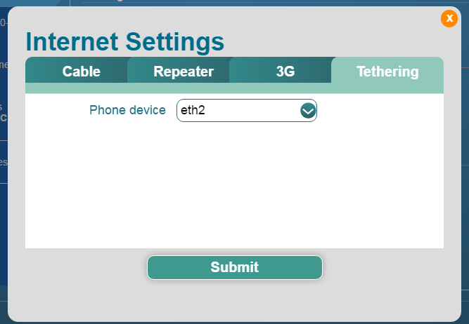

# Working with 3G/4G modems and phone tethering

This guide is update for firmware v2.264 and newer. Please upgrade the firmware if you are using an old version.

### Compatible 3G, 4G LTE modem List

With Standard OpenWrt CC1505 distribution installed, the mini router support hundreds of 3G 4G dongles on the market. However we cannot test all these models.

Here is a list of supported modems we tested. 

* QMI: this modem support QMI mode, please refer to the setting sections
* Hostless: this modem support tethering mode, please set up tethering

| Model                                  | 3G/4G | Tested | Tested by       | Comments |
| -------------------------------------- | ----- | ------ | --------------- | -------- |
| Quectel EC20-E, EC20-A, EC20-C         | 4G    | Yes    | GLi             |          |
| Quectel EC25-E, EC25-A, EC25-V, EC25-C | 4G    | Yes    | GLi             |          |
| Quectel UC20-E                         | 3G    | Yes    | GLi             |          |
| ZTE ME909s-821                         | 4G    | Yes    | GLi             |          |
| Huawei E1550                           | 3G    | Yes    | GLi             |          |
| Huanwei E3276                          | 4G    | Yes    | GLi             |          |
| TP-Link MA260                          | 3G    | Yes    | GLi             |          |
| ZTE M823                               | 4G    | Yes    | Arnas Risqianto |          |
| ZTE MF190                              | 3G    | Yes    | Arnas Risqianto |          |
| Huawei E3372                           | 4G    | Yes    | anonymous       |          |
| Pantech UML290VW (Verizon)             | 4G    | Yes    | GLi/steven      | QMI      |
| Pantech UML295 (Verizon)               | 4G    | Yes    | GLi/steven      | hostless |
| Novatel USB551L (Verizon)              | 4G    | Yes    | GLi/steven      | QMI      |
| Verizon U620L (Verizon)                | 4G    | Yes    |                 | hostless |
|                                        |       |        |                 |          |

You can also refer to [http://ofmodemsandmen.com/supported.html](http://ofmodemsandmen.com/supported.html) for a well supported modem list.

Modems can be Regular USB or Host-less versions. If it is host-less, it will work as tethering.

## General 3G/4G Modem Settings

Using the mini router, you can connect to the Internet using 3G or 4G modems. Click the `3G/4G` tab to enter the UI.

**Note:** If the modem supports `hostless` mode, please go to next section.

To make the correct settings:

* **Modem device**: Please choose `/dev/cdc-wdm0` if this modem support QMI, otherwise you may choose one `ttyUSB*` device. There are several `ttyUSB` devices, you need to choose the one for data. You need to check the modem spec for find out which one is for data.
* **Service Type**: This is only necessary for 3G connection. For 4G connection, this setting is not necessary.
* **APN**: This is the most important settings, check your ISP for the correct settings.
* **Dial Number**: Generally this will be a default value and you don't need to set by yourself. But if you have this info, please input.
* **Pin, Username and Password:** Generally this is not necessary for a unlocked SIM. But if you purchase a locked SIM card, please find these info from your ISP.

The router have some pre-configured values. You can choose `Country/Region` and `Service Provider` and the values below will be filled automatically. But this is not `necessary` if you know the settings. If you found that the data is not updated, please [write to us](mailto:support@gl-inet.com).

After you plug in your modem, you will see the device in Modem Device list. There maybe several devices and you need to try different devices. Most devices are ttyUSB2. In my case it is ttyUSB1.

**Some new modem models works like Ethernet devices and you need to use Tethering.** Please check next section for this.

### Example: US Verizon setup

We found that for Verizon you can use `internet` or `Ne01.vzwstatic`. The second APN seems make better performance. Please report to us if you have some update.

Now click `Submit`.

**If you used the wrong `ttyUSB` device, you need to try another one. Some modems needs you to unplug it first and plug in again. You can also do a `reset` of the modem (not the router) from the UI.**

## Modem status

In Internet status windows it will show the status of 3G/4G connection.

There are two buttons what you can use in case you have problems with the device.

- Reset: This will hard reset the modem, which means the modem (not the device) will power off and on again. This takes 40 seconds to 1 minutes. Be patient and wait for the modem to get connected. You need to reset the modem in case the modem encounter problems or your insert the SIM card after the device boot or change SIM card.
- Disconnect: This will just disconnect the modem network, but it will not disconnect the modem power.

## Phone (modem) Tethering

If your modem support hostless mode or you want to share the data of your phone, you can use `Tethering` mode. 

Note: The stock firmware support iPhone and most Android phones. You have to enable `Tethering` or Sharing in your phone.

Note: For iPhone, the first time you connect your phone to the router, you phone will ask if you would like to `Trust` the computer it connected to. Please click `Trust`.

Then click `Tethering` tab. Your smartphone will appear as a network devices, with names: `eth1 eth2 usb0` etc. depends on the model.

Just click `Submit` to go wait for your modem/phone is connected.

### Easytethering

Some carriers don't allow sharing data and you cannot use the above way. You can try [easytethering](/docs/openwrt/tether/). 

**Note:** Easytethering is not a free service and we have no affiliate with them.

# Discussions
