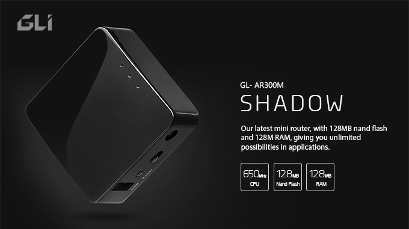
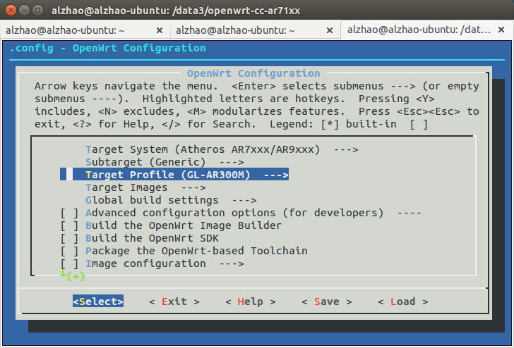
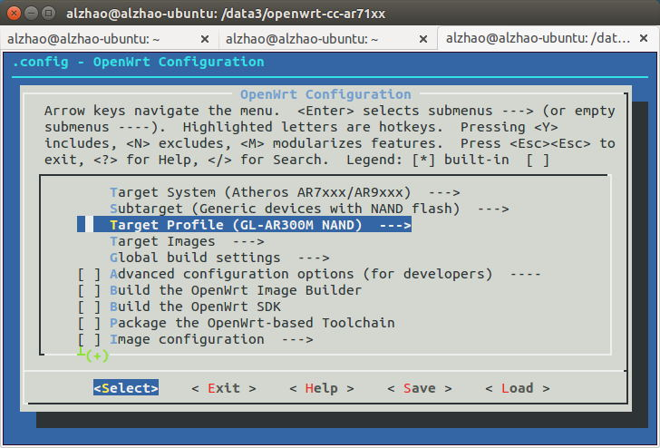

# AR300M, the ultimate Mini router

The hardware specs of a mini router is pushed to the limit on AR300M.

## Features



* Atheros 9531 650Mhz CPU
* 300Mbps 2.4G WiFi
* Dual Flash: 16MB Nor + 128MB Nand
* 128MB DDR2 RAM
* I2C, UART, PCIe, USB-A Interfaces

By using 128MB Nand flash, space is not a problem and the writing speed is improved greatly. You can compile a firmware with tons of features and writing data is almost instant.

By adding PCIe interface, a 5G 802.11a/ac addon module can be connected and you can enjoy the wifi speed on a mini router.

## Performance

By adding a fast Nand flash, you can feel how the performance is improved compared to a Nor flash router.

The performance comparision between AR300M (nand) with AR150 is below:


It only takes 6 seconds to upload and process 250 ovpn files. When installing packages to the router, it takes no more than 20% for the time spent than using nor flash, including the time to download resource from the Internet. So everything just happends in seconds.

## Build the firmware

The router has two flash so we have two firmware. One firmware is installed on the Nor flash and one is installed on the nand flash. The two firmware is independent from each other. The router will always try to boot from the nand flash. If it fails for 3 times it will boot from the Nor flash.

By using two firmwares, businesses can have dual boot options to ensure the system can backup, upgrade and boot without problems.

### Building the generic firmware for nor flash

The simple instructions of building the firmware can be found here: https://github.com/domino-team/openwrt-cc
You need to have a Linux machine. In this example we use Ubuntu.

```
$ sudo apt-get update
$ sudo apt-get install subversion build-essential git-core libncurses5-dev zlib1g-dev gawk flex quilt libssl-dev xsltproc libxml-parser-perl mercurial bzr ecj cvs unzip git wget
$ git clone https://github.com/domino-team/openwrt-cc.git
$ cd openwrt-cc
$ ./scripts/feeds update -a
$ ./scripts/feeds install -a
$ make menuconfig
  ..choose your compile target and packages
$ make

```
If you want to build the firmware for nor flash, choose `GL-AR300M` as the target.



If you want to build the firmware for nand flash, first choose subtarget `Generic devices with NAND flash` then choose `GL-AR300M Nand` as the target.



The make process will takes around 1 hour for the first time because it needs to download a lot of data from t he Internet. After compiling finished, you will find the following firmware files in `bin/ar71xx/`

* **openwrt-ar71xx-generic-gl-ar300m-squashfs-sysupgrade.bin**, for nor flash
* **openwrt-ar71xx-nand-gl-ar300m-squashfs-sysupgrade.tar**, for nand flash firmware upgrade inside of a working Openwrt firmware
* **openwrt-ar71xx-nand-gl-ar300m-ubi.img**, for initial nand flash firmware build, this is used when upgrading using uboot.

!!! Note

There is two file for nand firmware. The `xxx-ubi.img` is used for first time writing to the nand flash. If you are using uboot to upgrade the firmware, please use this one. The `xxx-sysupgrade.tar` is used for upgrading from openwrt. So if you use our stock firmware or already using an openwrt firmware, choose this one.

## Using the firmware

The firmware has exactly the same UI as our other mini routers. To determine you are using nor flash or nand flash, please check the available space from the UI.


# Discussions
