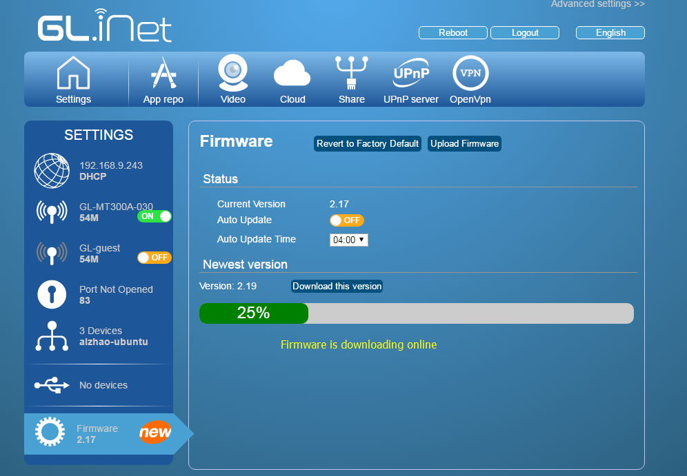
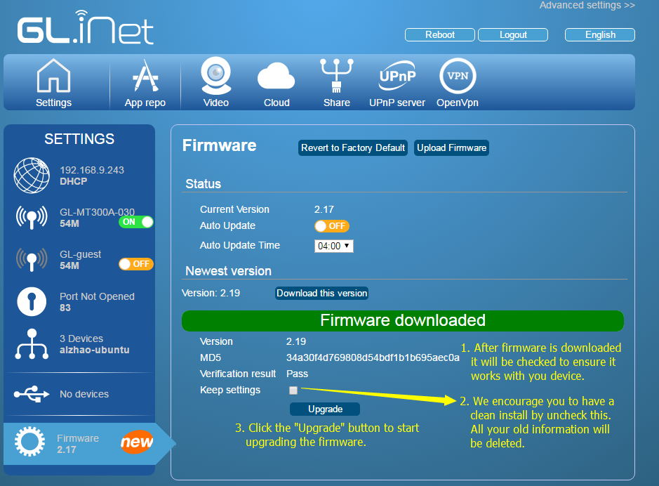
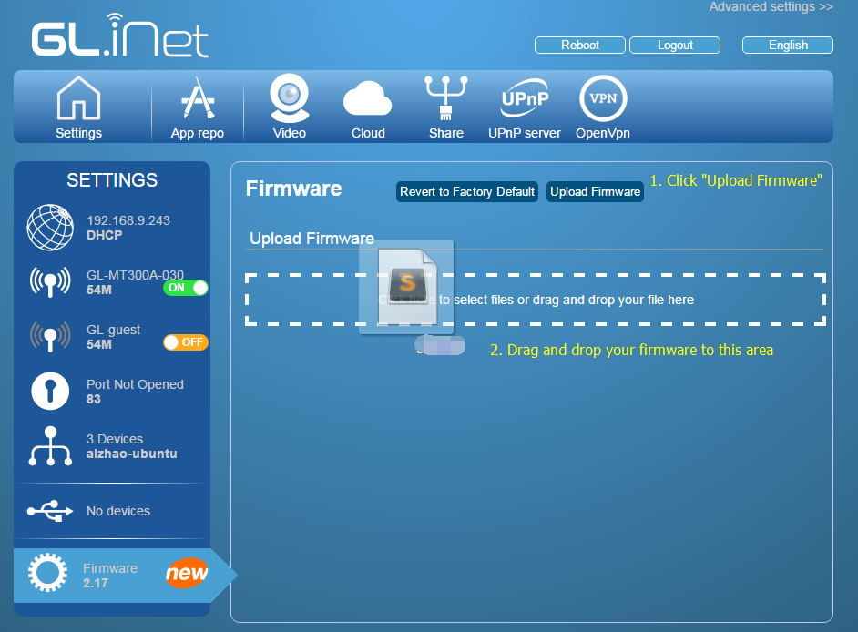
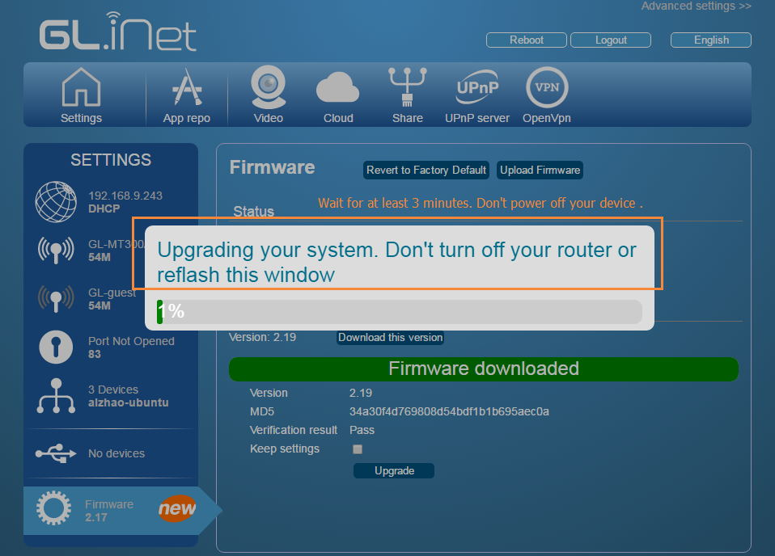
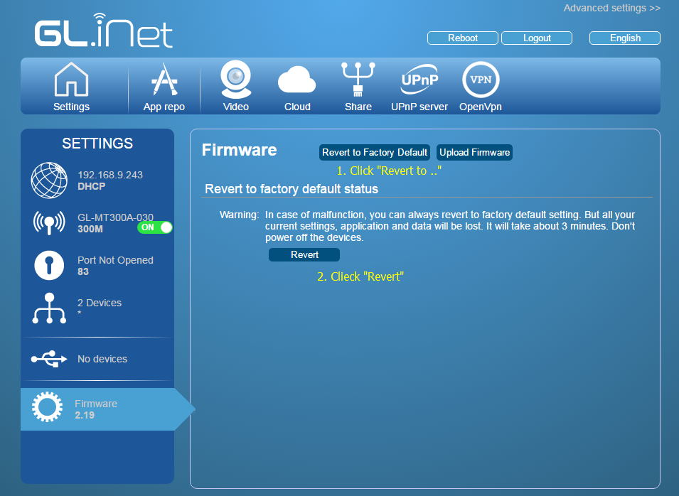

## Firmware UI

The firmware is under continuous development, to include new features, fix bugs and improve user experience etc. We release firmware quite frequently. When you receive the device, it is not supprisely you have an older firmware. We suggest you to upgrade to new firmware immediately.

1. You will be displayed a `New` Icon when there is a new firmware available.
2. Click the "Firmware" icon, you will be displayed options to upgrade the firmware. The current version is displayed.
3. You can enable "auto update" option to let the router upgrade automatically if it detects a new version. This option is disabled by default.
4. You will have a `Download` button if there is a new version. Click it to start download.

## Download online

Click the `Download` button to start downloading. It will takes some seconds depending on the network.

After download, the device will verify if the firmware is usable. If verified, you will have a `upgrade` button to start upgrade the firmware.

**It is suggested to uncheck the "Keep setting" check box to have a clean install.**

**If you kept settings and encount problems after install, please reset the device by pressing and hold the `RESET` button for more than 8 seconds.**

## Upload your firmware

Before we release a new firmware, we may put them online for testing first. The link is http://www.gl-inet.com/firmware/testing

You may compile your own firmware, you can also upload to the router.

1. Click "Upload Firmware" button and you will have a rect to for uploading purpose.
2. Click the rect to select file or just drag and drop your firmware to the rect. The firmware will upload and be verified.

Warning: Don't rely on the verification status from the UI. You are responsible to upload a compatible firmware.

## Start upgrading

After you download/upload a new firmware and it is verified, you an upgrade now. Just click the `Upgrade` button and wait.

1. You need to wait about 3 minutes
2. **Don't turn off the power.** If you do so, your device maybe bricked.
3. You may need to reconnect to the device after upgrade. For example, your ssid and key maybe changed back to default one.

## Revert to factory status

If you have problems in settings (for example repeater) or firmware upgrading, you can try to revert to factory status.

**factory status** means erasing all your settings, but not the original firmware if you upgrade it. If you just upgrade from v2.17 to v2.19, revert to factory default status will give a a clean v2.19.

1. Clieck the "Revert to Factory Default" button.
2. Read the warnings and click "Revert" now. It takes 1 or 2 mintures.

### Using the Reset button to revert

**After the firmware boot**, you can press and hold the `Reset` button for 8 seconds to revert to firmware back to factory status. The LEDs will flash in a pattern, indicating it is working.

This function only in our stock firmware. If you compiled your own firmware, it may not work.

## Debricking using Uboot

Sometimes you can brick your device, especially if you have your own firmware or uploaded an incompatible firmware.

All the mini routers have uboot web UI so that you de-brick your device using a workable firmware.

The orignal post is here: http://www.gl-inet.com/how-to-enter-the-uboot-web-ui/

1. Connect `only one` cable to your router, and leave the other LAN port unconnected.
2. First press and hold the Reset button firmly; then power on your device. (Obey the first and then procedure)
3. The LEDs will start to blink. Find the video for different routers below.
4. Release your fingers when you see the LEDs flash `5` times for AR150, AR300M and 6416. For MT300N and MT300A, the LEDs will flash `3` times and enter Uboot Web UI automatically.
5. Set your computer’s IP address to `192.168.1.2`
6. User Firefox or Chrome to visit `http://192.168.1.1`
7. Find your firmware and upload
8. Wait around 3 minutes. Don’t power down your device while upgrading.

AR150:

MT300N and MT300A

GL.iNet6416 and complete upgrading prcess

# Discussions
