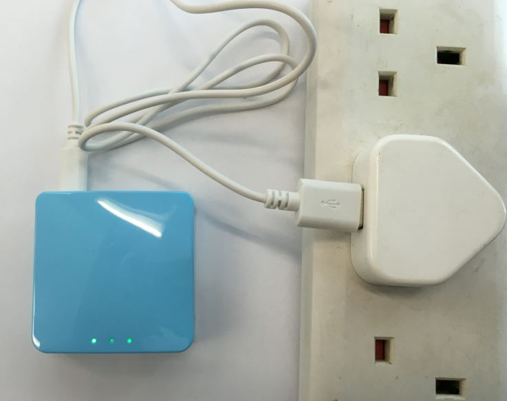
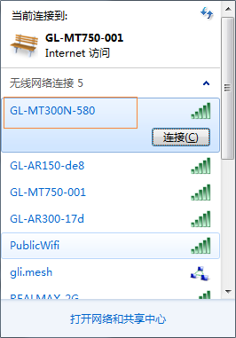
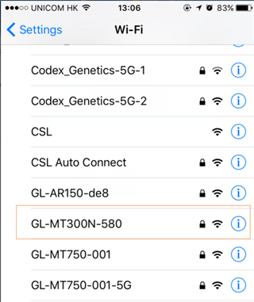
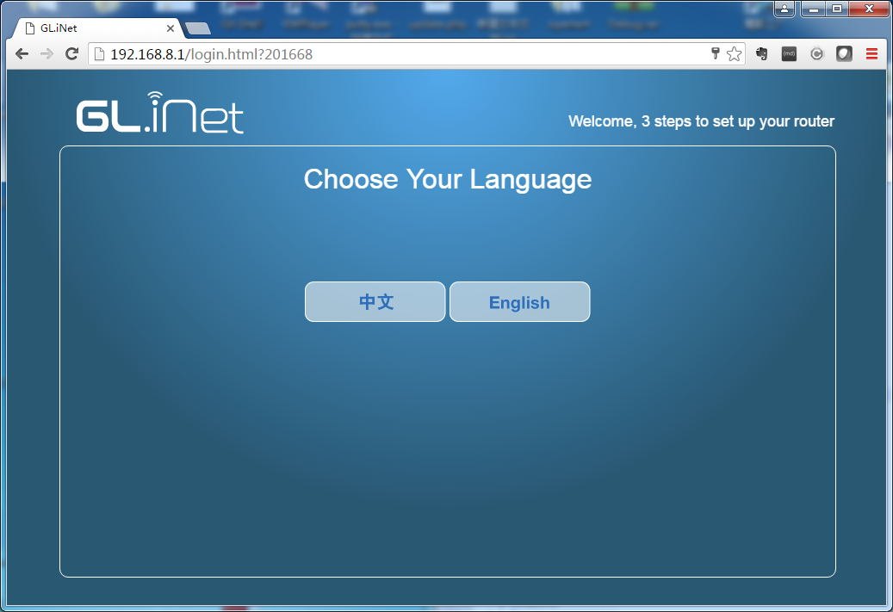
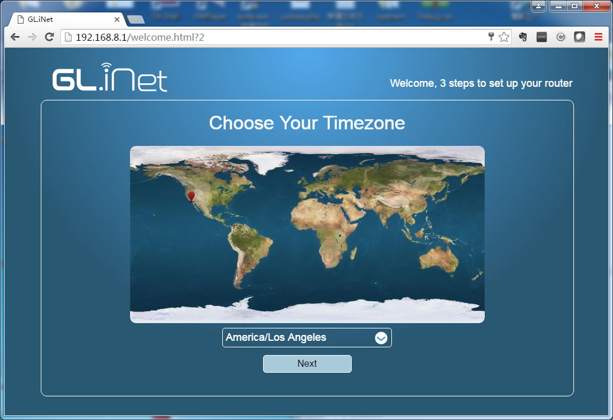
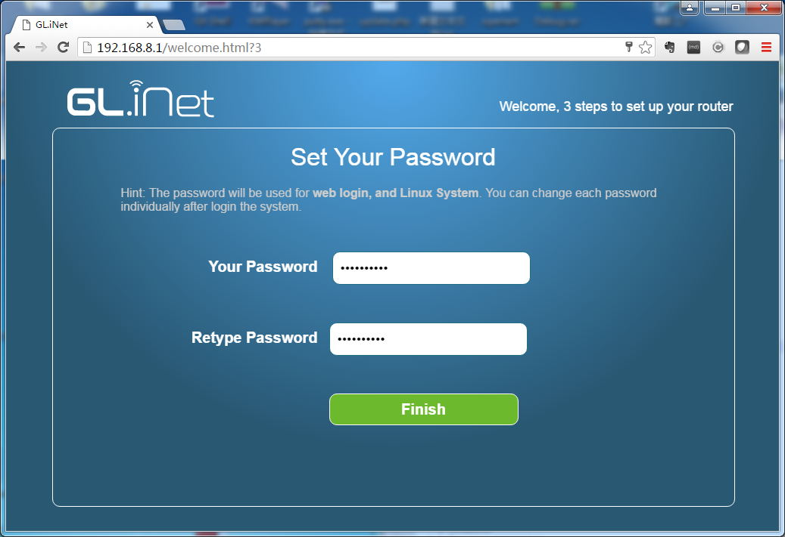
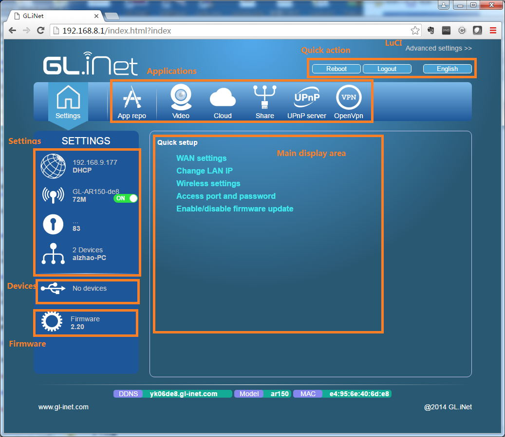
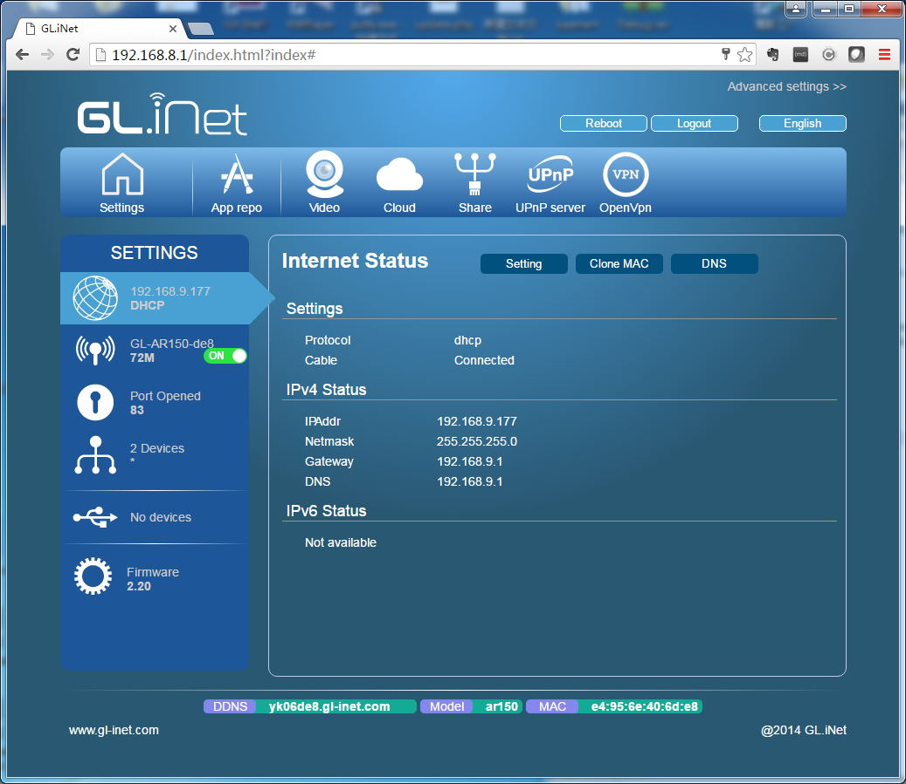

# Getting started with GLi Mini routers

connection, first-time setup, button and leds

-----------

## Connections

You need to power the mini router up using a USB 5V/1A power adapter. The power adapters for smartphones are perfect for this.

Please wait around 1 mintues until the router start up.



You can connect the mini router's WAN port to your main router or modem using an Ethernet cable.


Now connect your PC to the LAN port or connect via wifi.




The SSID of the mini router should be printed on the bottom of the router. It should be one of the following format, according to your device models:
```
GL-iNet-xxx
GL-AR150-xxx
GL-AR300M-xxx
GL-MT300N-xxx
GL-MT300A-xxx
```
The default wifi password is `goodlife`

## First time Set Up

Now open a browser (we recommend Chrome, firefox) and visit [http://192.168.8.1](http://192.168.8.1)

You will have the welcome page. First you need to select your language. We now only have `Chinese` and `English`.



Then you need to select your region. You can use your mouse to click on the map. You can also select from the select box.



Third, you should set your own password for this admin Interface. There is no default password. Before sure to input a password with length longer than 8.

**This password is for the admin UI and the embedded Linux system. It doesn't change your wifi password.**



Now let's click `Finish`. You will be logged into the admin UI.

## The Interface

The interface is quite intuitive and straightforward.

On the top is the icons for applications. On the left side is the settings. The middle is the main display area.



You can click the `Internet` icon to display the current method of connecting to the Internet. The default method is DHCP, which requires you using a cable to connect to the Internet.



## Buttons and LEDs

You can use the Reset button to turn wifi on/off.

The default function of the switch is to hide (right side) or show (left side) the SSID.


The left LED is used for power indication. It should be always on.

The middle LED doesn't have functions by default. You can configure it according to your own use.

The right LED indicate the current status of WiFi. If WiFi is on it should light up. If you have data transmission, it should flash.


## Change your ssid and key

You should change your ssid and key now to protect your mini router being used by others. Consult the WiFi setting sections.

# Discussions
