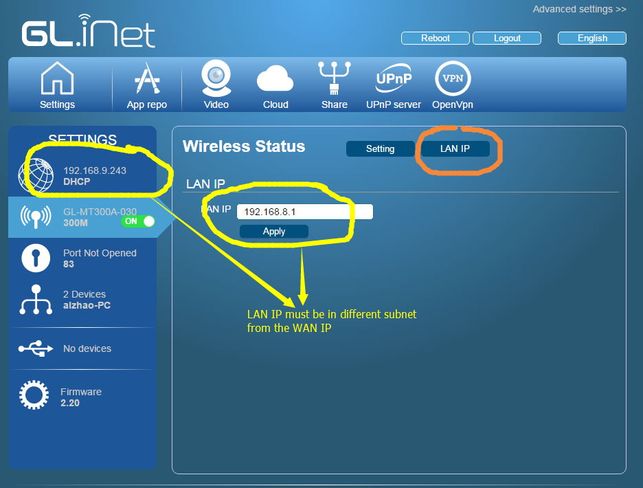

## LAN IP address

Sometime you need to change the LAN IP address of the mini router. The default IP address is `192.168.8.1`.

Most of the routers use IP `192.168.0.1`, `192.168.1,1`, `192.168.1.254`, `10.10.1.1` etc. and subnet `255.255.255.0` (`/24`). It is important that your mini router's IP address is different from these. If your main router has a `192.168.8.x` IP, you need to change the LAN IP address of the mini router.

You can find the IP address of your main router from its own admin UI or just check the mini router's admin UI.

In the following example, the WAN IP of the mini router is `192.168.9.243` (assume the netmask is `/24`), and we are ok to keep `192.168.8.1` as the LAN IP.

# Discussions
