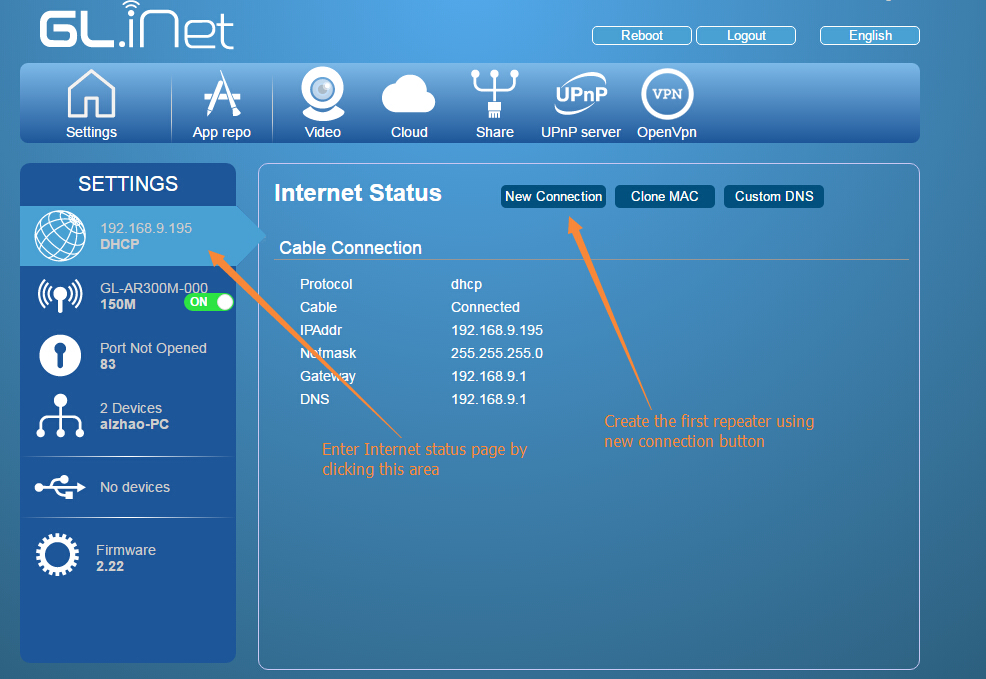
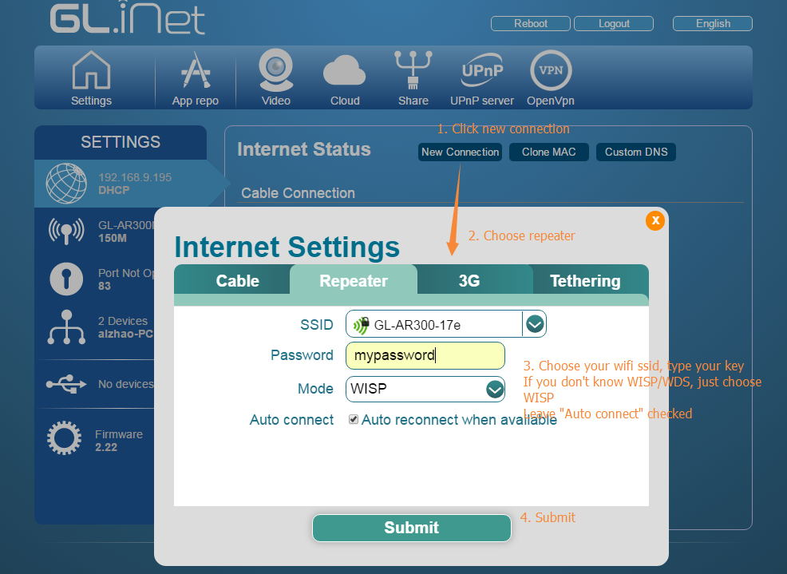
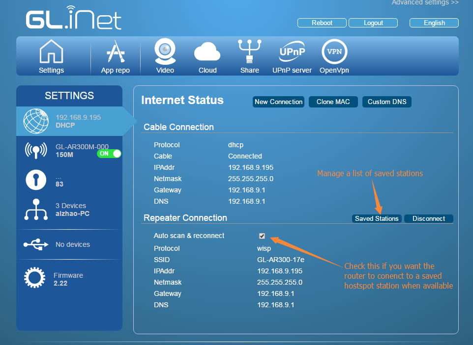
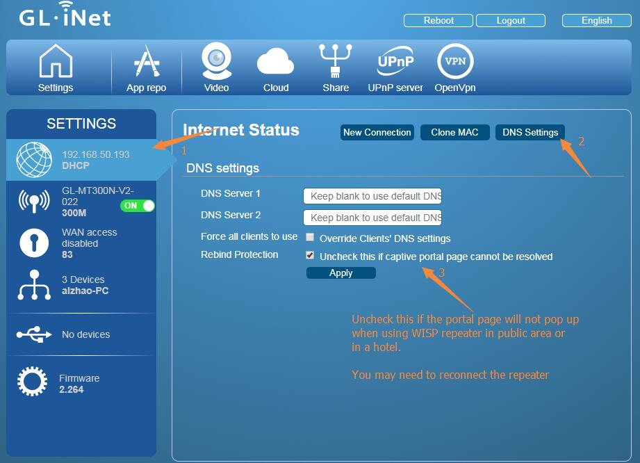

# Repeater Manager for GLi Mini routers

From firmware v2.22

## What is repeater (station) manager

Most of the the mini routers is One-Radio device, which caused a problem in repeater mode. When your repeater cannot connect, its own ap will not boot.

So we developer a daemon program "repeater manager" to make sure your ap is usable. It does the following:

1. All repeater (including WISP and WDS) stations you connected to will be saved in the router. You can choose if they will be auto connected to or not.
2. When the current set station cannot be connected to, the router will search for one available station and try to connect to it.
3. If none of the saved stations can be connected, the router will just disable sta mode to make sure your AP is ON
4. You can turn on/off the "auto-scan and connect" function in Internet status page. But if no sta can be connected, it will still disable your sta so that your AP is ON.

## Set up repeater for the first time

To set up repeate for the first time, just click "Internet" area in Settings page and build a new connection using "New connection" button.

Choose Repeater Tab, the router will search for available stations automatically. Choose your ssid and type your wifi key.

There are two modes for repeater.

* WISP: stands for Wireless Internet Service Provider. Use this mode if you want the router have its own sub-network. Generally this is the case for public Wi-Fi hotspot.
* WDS: stands for Wireless Distribution System. Use this if you are extending your own network and want every devices works in the same sub-network. Make sure your main router also enabled WDS. **WDS may only work with GL.iNet (OpenWrt) routers as WDS implementation**

Click "Submit" and wait a while to let the router connected as repeater.

## Control the repeater

When repeater is connected, you will see the wifi connection in your Internet status.

Here is two actions you can do to control your repeater connections.

* Auto scan & reconnect: When clicked this checkbox, the status will updated immediatelly. When enabled, the router will automatically scan and reconnect your repeater if the current connection failed. For example, when you move away from home to office, it will change the connection to your office's wifi network automatically if you have saved this information before.
* Disconnect: You can disconnect current connected station. When you click, you will be asked if you want to disable the "auto scan & reconnect" function. You can choose "OK" (means YES) or "Cancel" (means NO). If you choose NO, the auconnect feature may reactive this connection which you just disconnected.

## Manage saved stations

Click the "Saved stations" button and you can manage your saved stations.

The current connection will be **bold**.

You can delete or choose which station to connect. If you choose to connect a station but it fails, the "auto reconnection" daemon may connect you to another network.

You can also disable "auto-connect" for a choose station.

## Get through the Portal Page

When you use in a hotel or public café, it is very common that the wifi doesn't have a password but they will have a Captive Portal (authentication) page so that you agree to the terms. 

Generally this page will still pop up when you use the router as WISP. But some portal page cannot pop up because of DNS problems. The browser will tell you that the DNS cannot be resolved. When this happen you need to disable `DNS Rebind Protection` so that you can access the portal page. Find DNS settings in Internet status page, and uncheck `Rebind Protection`, then click `Apply`. After several seconds the router will apply the settings and you can go through to the portal page. 

You may need to reconnect the WISP repeater in order to let the setting take effect.

## FAQ

###1.Can I set priority of stations?

No. Not now.

###2.What my saved stations cannot be connected? I am sure my key is correct.

Sometimes, when the router cannot connect to a station for many times, it will blacklist it. You have to reboot your router to clear the blacklist.

# Discussions
