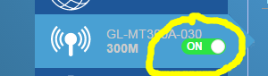
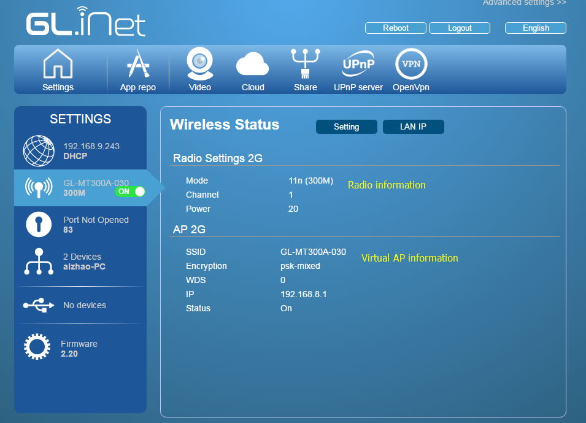
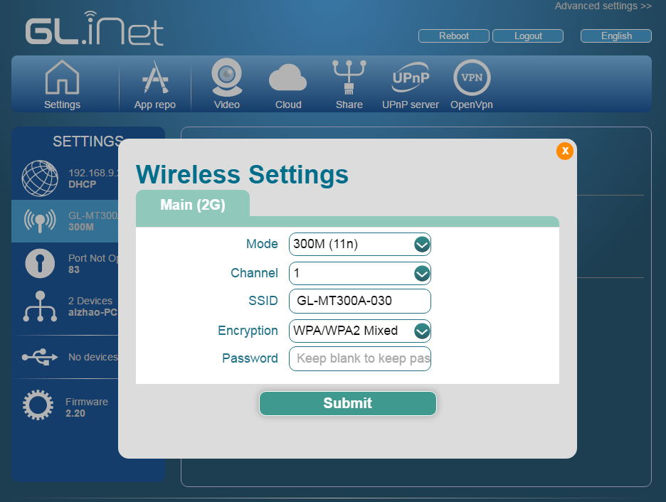
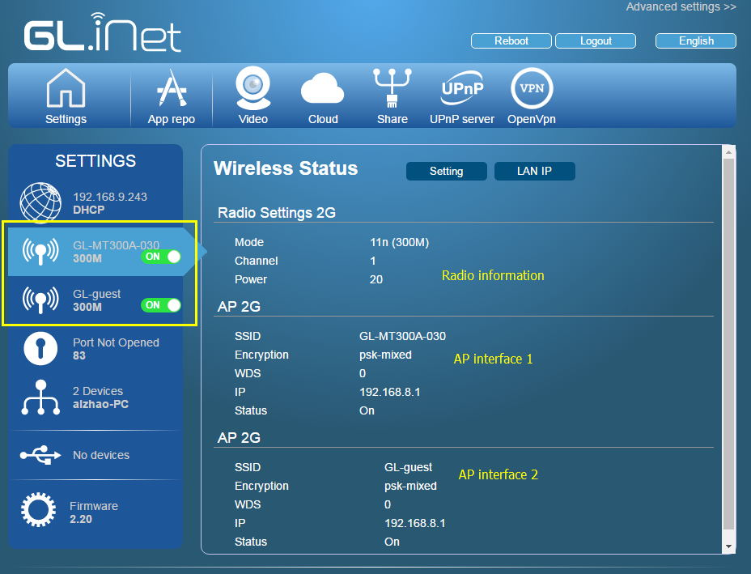
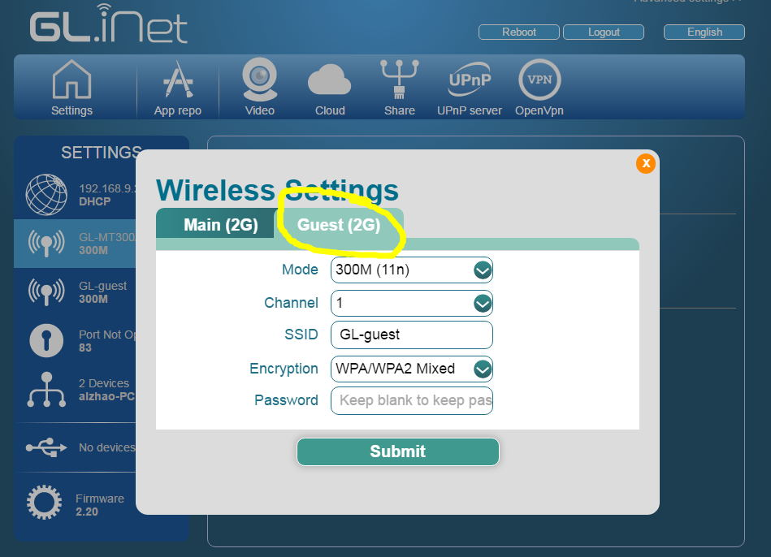
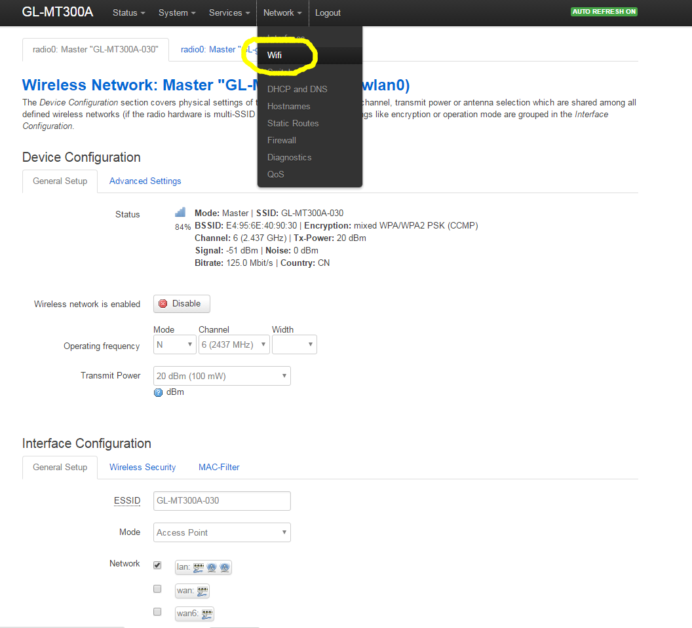

#Wireless Settings

## Turning on or off the radio

You can turn on or off the radio from the main UI by the switch. It takes effect immediately.

## Wireless status

When you click the `wifi` area in the settings sidebar, the UI will display the wireless status.

There are two parts of the status. The first part is `Radio` information. The seconds part is `Interface` (Virtual AP) information.

One router may have one of more Radio devices and one device can have multiple Virtual interfaces.

In this example, the channel is `1` and tx power is `20`. We have one AP interface with SSID `GL-MT300A-030`.

## Wireless Settings

If you click the `Setting` button, the UI will pop up the wireless settings page.

You can change the

`mode`: You can change from 802.11 b/g/n etc.

`channel`: The router will not choose the best channel itself. You need to choose one channel by yourself. You will have different choices depends on the region you selected. In the US, you can choose 1 to 11. While in China and EU you can choose 1 to 13.

`ssid`: It is not suggested to use unicode characters in the ssid, e.g. Chinese.

`encryption`: You can only choose from WPA, WPA2 or WPA-Mixed. You cannot choose WEP or open because it is insecure. If you have to choose WEP or don't want to set a password, do this in Advanced settings (Luci).

`password`: If you keep the password value empty, it will use the old password. A password should be at least 8 byte long. Choose a password with 9 or longer length to ensure security.

**Don't use the same password as your banks etc.**

**We suggest you change your password immediately when you use the mini router.**

## Multiple Interfaces (SSID)

You can set multiple SSID for the mini router, but this is not support to create in the current UI. You can do this in Advanced settings (Luci) or using ssh.

However the current UI can display after you create the interface.

If you have multiple SSIDs, the main UI will display the status. You can turn on off any one or both. The status page will display the information of these interfaces as well.

When you want to change the settings, you will have multiple TABs.

**Multiple AP Interfaces share the same radio configuration (mode and channel). You cannot set different values for each Interface**

## LED indication

The right LED of the mini router indicate the status of the first AP.

If you have multiple SSIDs, you can configure another LED to indicate the status. For example, I want to indicate the status of my second AP using the middle LED.

Go to Advanced settings (Luci) -> System -> LEDs, add one settings. The following sample is for GL-MT300A. Other mini routers may have different LEDs names.

## WDS AP Interface

To enable WDS support on the virtual interfaces, you need to go to advanced settings.

Then click `Network->wifi`, choose the interface and click edit.

You need to choose `Access Point (WDS)` other than the default `Access Point` mode.

# Discussions
