# GL Router Shadowsocks(SS) Setup Manual

## General Description of Shadowsocks 

Shadowsocks** is an open-source encrypted proxy project, widely used in mainland China to circumvent [Internet censorship](https://en.wikipedia.org/wiki/Internet_censorship_in_China). It was created in 2012 by a Chinese programmer named "clowwindy", and multiple implementations of the protocol have been made available since.[[4\]](https://en.wikipedia.org/wiki/Shadowsocks#cite_note-github-init-4)[[5\]](https://en.wikipedia.org/wiki/Shadowsocks#cite_note-github-ports-5) Typically, the client software will open a socks5 proxy on the machine it is run, which internet traffic can then be directed towards, similarly to an [SSH tunnel](https://en.wikipedia.org/wiki/SSH_tunnel).[[6\]](https://en.wikipedia.org/wiki/Shadowsocks#cite_note-6) Unlike an SSH tunnel, shadowsocks can also proxy UDP traffic. 

-- Wikipedia 

## GL.iNet Router SS Server Setup	

### 1. Connect GL.iNet Router to a existing network (see user manual)

### 2. SSH Login the Router

#### 2.1. Windows User: 

##### 2.1.1. Download and install a PuTTY for windows user:

Go to the following webpage to download the latest PuTTY version：  

https://www.chiark.greenend.org.uk/~sgtatham/putty/latest.html

##### 2.1.2 Install PuTTY for windows step by step

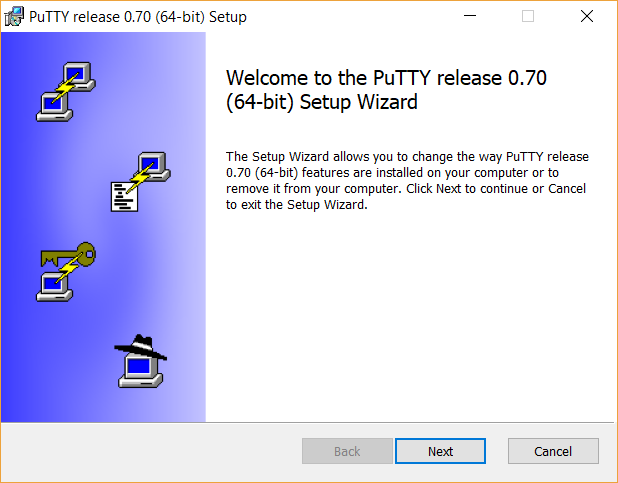

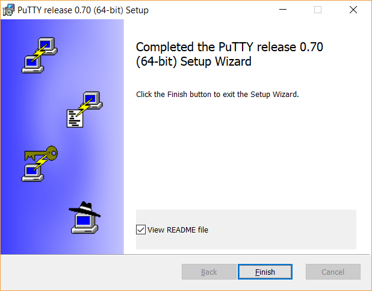

##### 2.1.3. Launch PuTTY in Windows 

Click **PuTTY** in Start Menu 

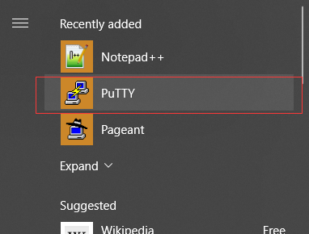

You will see the following Configuration Window: 

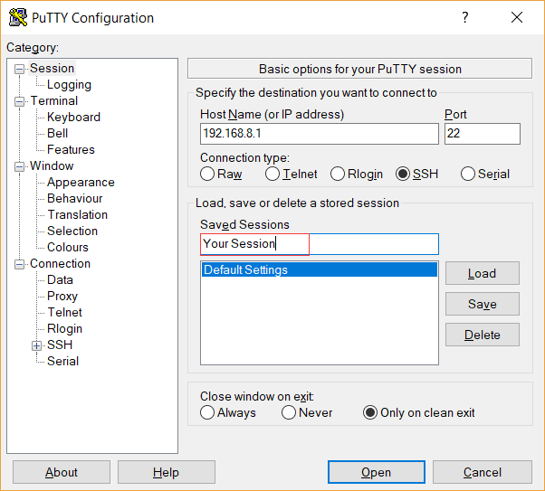

**Input** Host Name (or IP address) "**192.168.8.1**", Keep Port as default "**22**", select connection type: "**SSH**",

**Input** "**your session**" in saved sessions, click **<u>S</u>ave** at right side.

 

**Click "<u>O</u>pen"** at the bottom

A security alert will pop-up, click "**Yes**". 

login as：**root**

​	

​	root@192.168.8.1‘s password: **goodlife** (default password)

When you see above picture, that means you are now ssh login the router, 

this picture shows we login the router (GL-AR750 Model) as root user.

#### 2.2 Ubuntu User:

Click "**Terminal**"

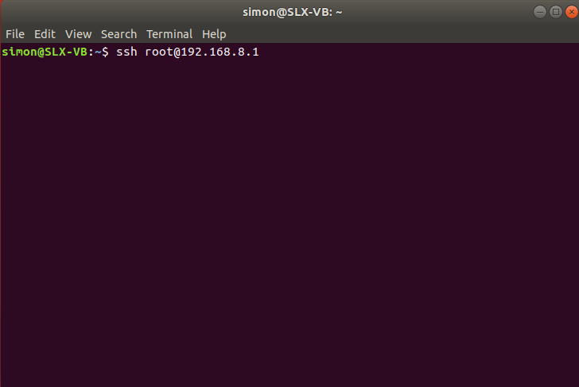

Input the following command: 

`user name@your computer name:~S SSH root@192.168.8.1` 

when you first login, Host key verification failed may displayed as follow:

input the red highlight command:

`ssh-keygen -f "/home/username/.ssh/known_hosts" -R "192.168.8.1"`

you will see the known_hosts updated. 

retry the ssh login command: 

`user name@your computer name:~S SSH root@192.168.8.1` 

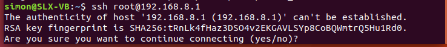

Type "**yes**"

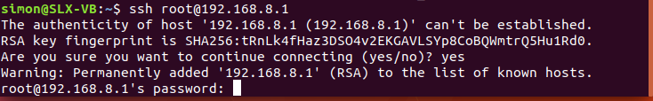 	

Input the router password: ***goodlife*** (default password, you can set this password when you first connect to your router)

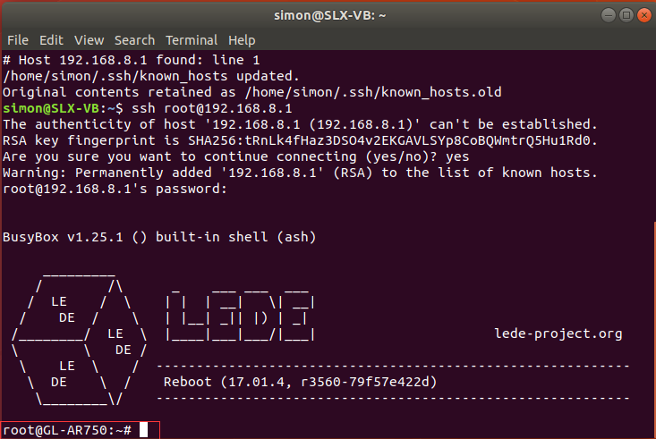

Final, you login the router when the above message displayed. 

### 3. Setup Shadowsocks Server 

#### 3.1 Edit Shadowsocks-server.json file

Input the following command to edit the configuration file "**shadowsocks-server.json**“ 

`root@GL-AR750:~# vi /etc/shadowsocks-sever.json` 

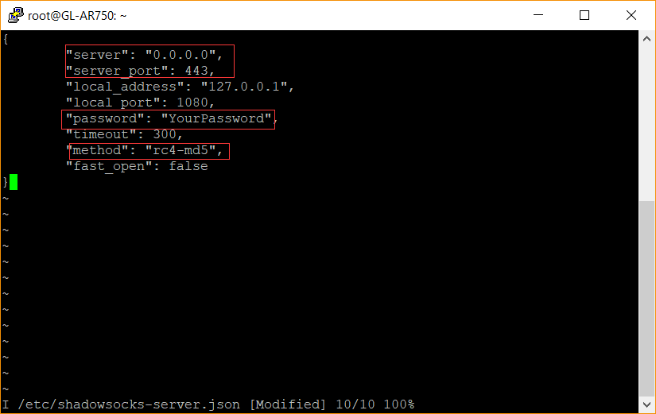

switch to edit mode by click "Insert" key, then you can change parameter in the configure file: 

1. ”Server“：**0.0.0.0** (default, don't modify)
2. **server_port”: 443**
3. "password":  ***your password***
4. "method": ***rc4-md5*** is default encrypt method, no need to modify it. 

when you finish all above modification, you can click "***Esc***" to exit edit mode, then click "***:***", input `wq` to ***write*** the modification into the configuration files and ***quit***. 

 

Type `exit` to quit the **Terminal** or **PuTTY**. 

#### 3.2 Edit ss-server configure file

Type `vi /etc/init.d/ss-server` in the command line

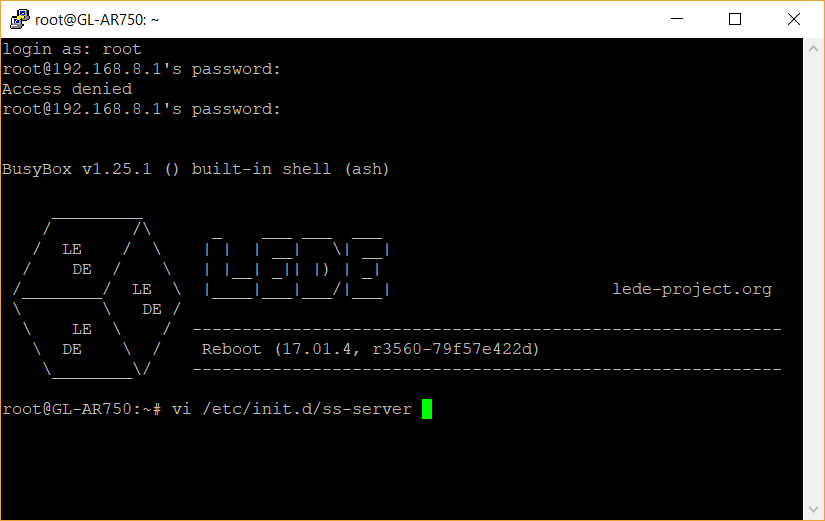

When you open ss-server configure file, you can see the following configuration

Click "**insert**" switch to edit mode, remove the "*****" before "/usr/bin/ss-server - C /etc/shadowsocks-server.json -u &", then click "**Esc**", to exit edit mode, and click“**:**”, input `wq` to save and quit the configuration file.

#### 3.3 Start SS-Server services

Input `/etc/init.d/ss-server start` , then the ss-serer services start on your router. 

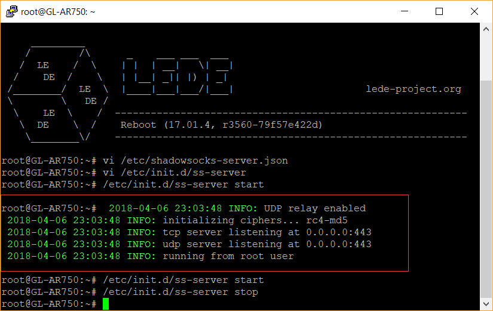

After you start ss-server, the above information will display. 

#### 3.4 Setup Port Forward via Management Page 

##### 3.4.1 Login web management page - advanced settings.

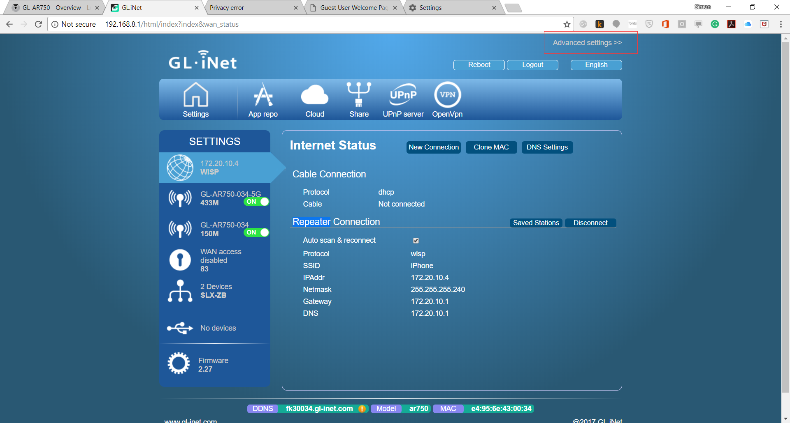 

A window will pop-up warning you to separately login as a root user into advanced setting. 

Click "***OK***"

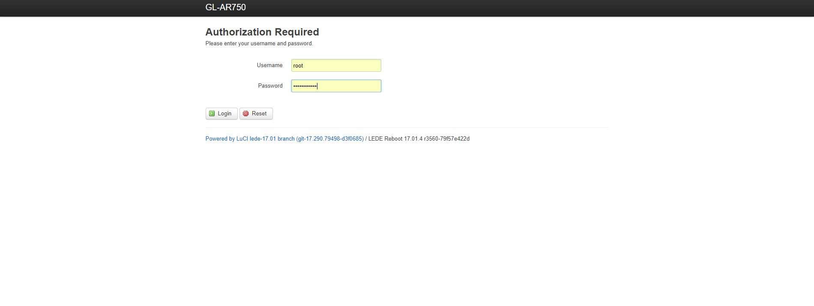 
Login with your password as a root user

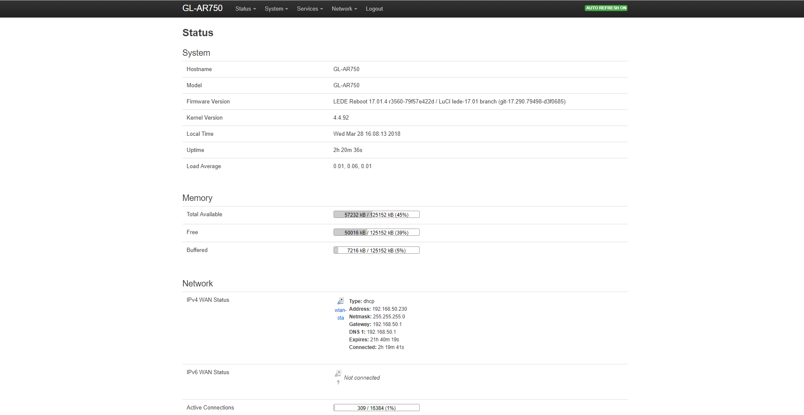  

Advance Setting Page Review 

##### 3.4.2 Enable Port Forwarding in Firewall Setup

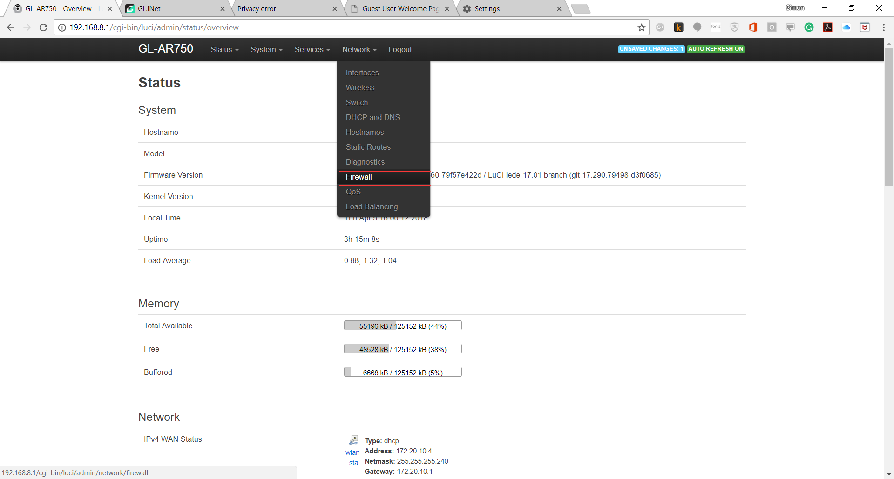 

Select "**Firewall**" in Network Pull-down Menu.

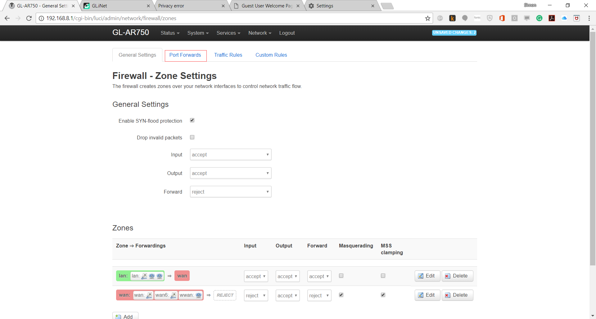 

Select "**Port Forwards**" Tab, and the following tab will display. please input port forwards information. in the "New port forward:", fill following information. 

Name: "**Your customize Name**"

Protocol: "**TCP+UDP**"  

External Zone: "**wan**"

External Port: "**443**"

Internal Zone: "**lan**"

Internal IP address: "**192.168.8.1**" (default AR750 IP address)

Internal Port: "**443**" 

Then click "**add**",

 

A saved Port Forwarding item with **Enable** ticked will displayed 

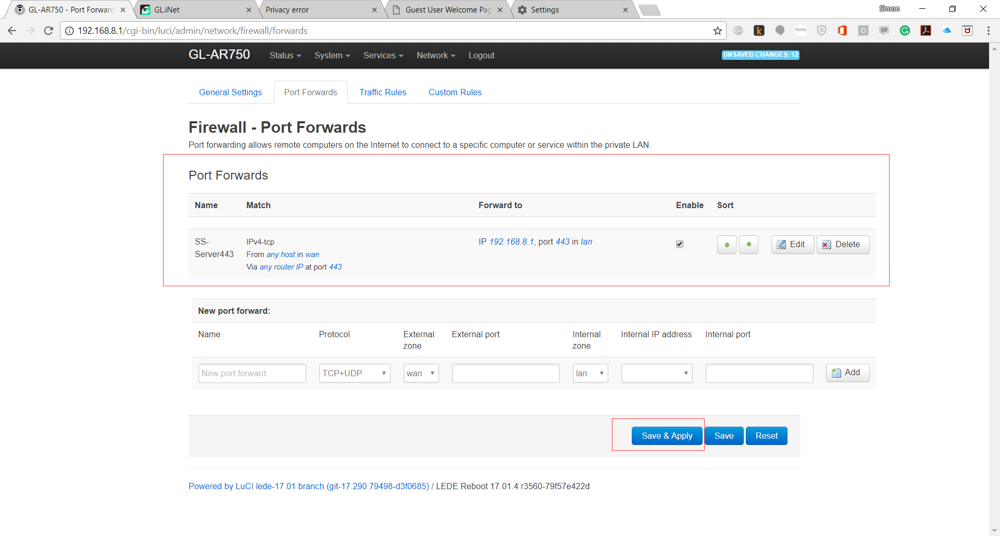 

Click "**Save & Apply**" to apply the port forwarding in this router.

##### 3.4.3 Open Port on Router

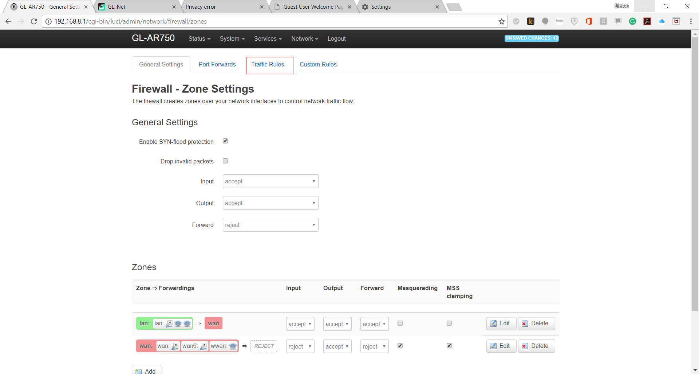 

Click "**Traffic Rules**" Tab to active external port forwarding in your network. 

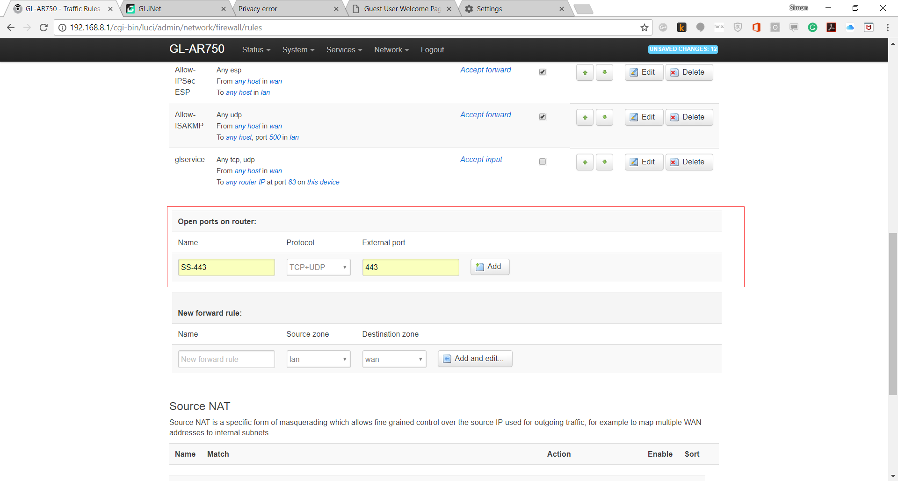 

Scroll down to the "Open ports on router" and input information as following: 

Name: "**your customs name**"

Protocol: "**TCP+UDP**"

External Port: "**443**"

Click "**Add**" after filling relate information and scroll down to the bottom, then click "**save&apply**" 

Now the port forwarding shall be activated and also the Shadowsocks Server is ready to use. 

### 4. Using Shadowsock in Platorm (OS)

#### 4.1 Find and Download the clients of your OS platform: 

https://shadowsocks.org/en/download/clients.html

#### 4.2 Check your public IP address

You can use any of your PC, laptop, tablet or smartphone to connect your Wi-Fi, then open a web browser (IE, Chrome, Safari, Firefox etc.)

Open any IP address checking website, the following websites are for your options: 

a. www.myipaddress.com

b. www.checkip.org 

c. https://www.whatismypublicip.com/

d. https://www.showmyipaddress.eu/

e. http://ip.w69b.com/

The webpage will detect and show your public IP address, record it. 

#### 4.3 Setup your client on different devices

Install the Shadowsocks Client on your device, then setup the following information:

Host: **your Public IP address** (you checked in step **4.2**)

Port: **443**

Password: **yourpassword** (same as you setup in ss-server)

Encryption: **rc4-md5** (same as you select in ss-server)

#### 4.4 Start using Private Shadowsocks Services

After setup, you just start your shadowsocks on your devices, enjoy it. 

You can test or check whether it's workable by open a web browser on your smartphone(use 3G/4G data but not WiFi), then go to a IP address checking website to check if the IP address is same as your SS-server public IP address. 

### 5. Shadowsocks Client Setup on AR750 router

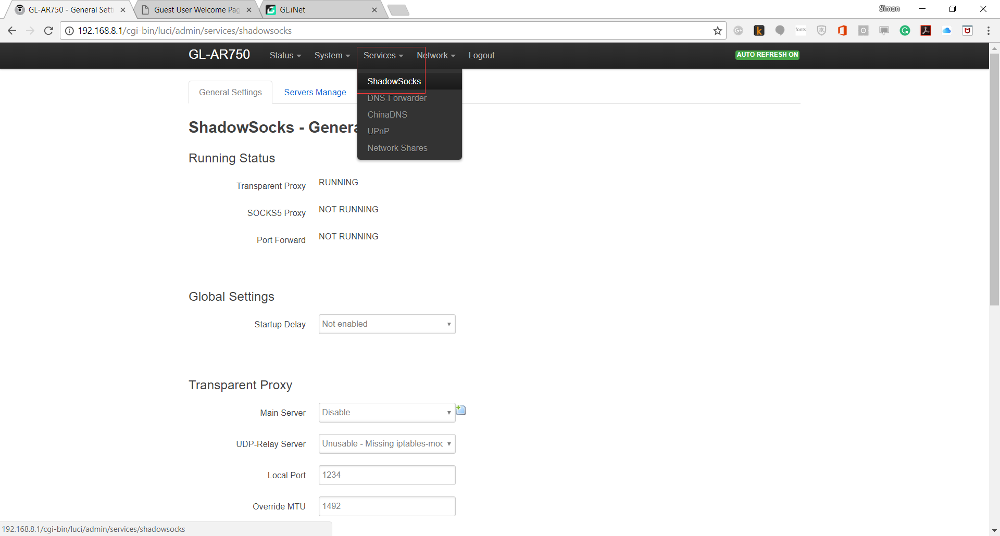 

Select "**Shadowsocks**" in the services pull-down menu. 

Click "**Servers Manage**" tab to setup SS-Client for GL-AR750 Router

 

Click "**Edit**", fill the following information: 

Server Address: "Your Public IP"

Server Port: "443"

Password: "Your Password"

Encrypt Method: "RC4-MD5"

Click "**Save&Supply**", 

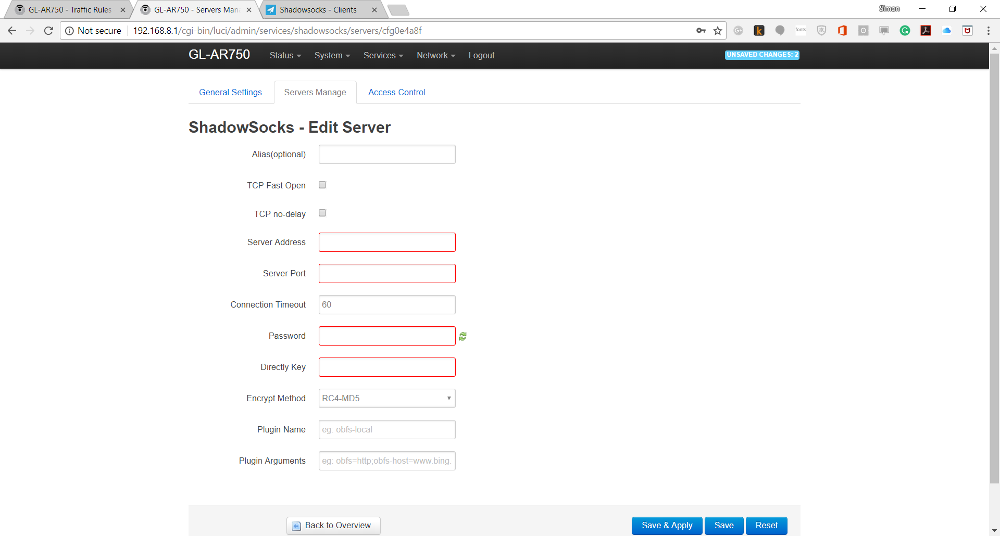