# Using OpenVPN in GLi routers

This docs only related to OpenVPN client, not server. 

Keyword: OpenVpn, OpenWrt, WiFi routers, Wireless routers

---

OpenVPN client is pre-installed in GLI mini routers GL-AR150, GL-AR300M, GL-MT300N, GL-MT300A from firmware v2.19.

Download the firmware for each devices: http://www.gl-inet.com/firmware/

The newest firmware maybe put in testing folder: http://www.gl-inet.com/firmware/testing/


Note: This assumes you have a .ovpn file. If not, read the bottom part of this page and buy one account.


This guide assumes that you have set up the router properly.

## Go to OpenVPN page

Click the OpenVPN icon on the toolbar. It will ask you to upload ovpn files.

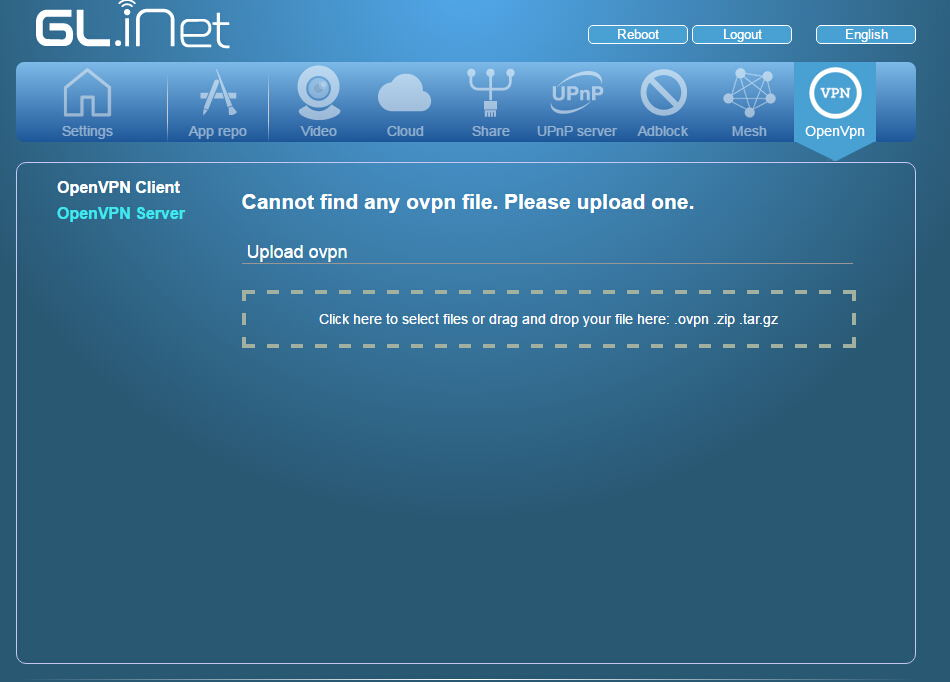

## Upload your .ovpn

Drap and drop your ovpn file to the white rect, it will be uploaded. The router will start to check the file automatically. If the file needs a separate username and password, it will prompt you and pop up a window.

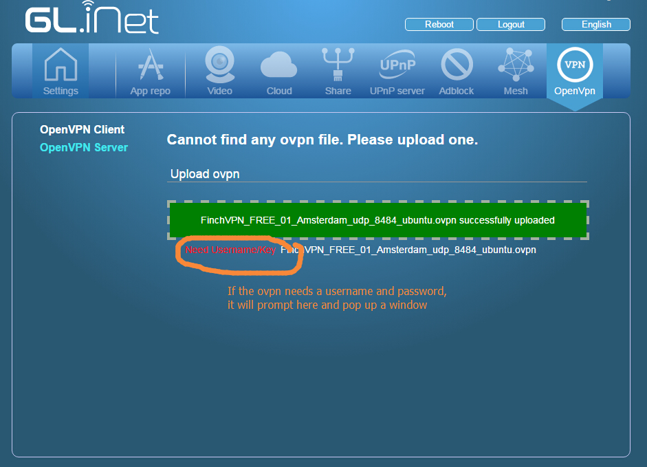


##Type your username and password

Now in the popup window, type your username and password. Then click "Submit"

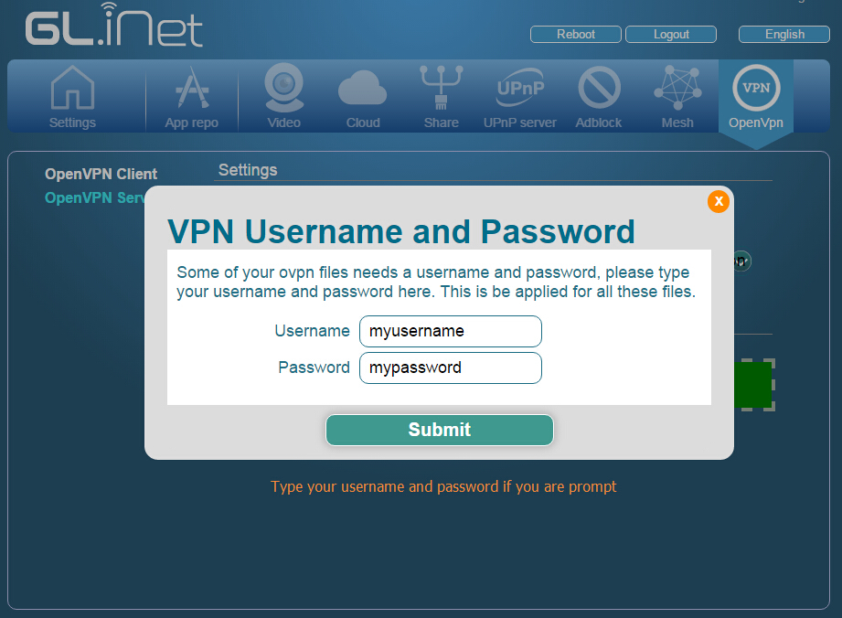


##Upload zip file of a lot of ovpn files

You can also upload zip or tar.gz files, which contains a lot of ovpn files. The router will unzip these file automatically and check each file.
Some ovpn files use separated ca, cert, crl files. These files must be in the same zip file when uploaded.

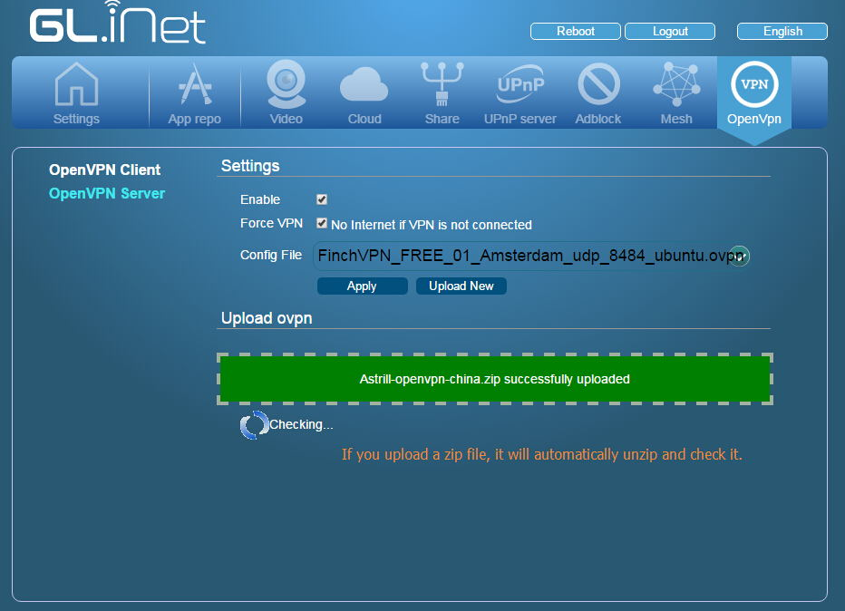

##Check ovpn

After check each file, it will list the files that can be used. Now reflash this page.


##Connect to openvpn server

After you refresh the page, you will be able to select servers and connect.

* Check "Enable".
* Check "Force VPN". When vpn is not connected, the traffic will go through normal Internet. If you want to avoid this and force all traffic go to VPN, check this.
* Then choose the right ovpn you want to use.
* Now click "Apply"

The router will display the progress of connection. When connected, you will be able to see data sent and received.

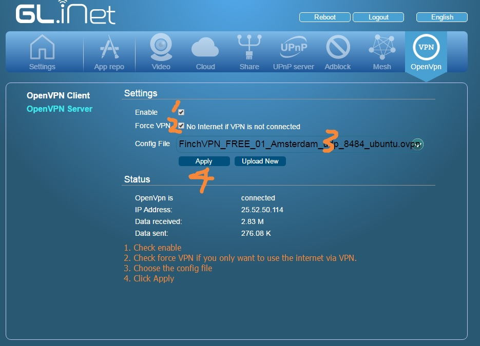

##Manage ovpn files

From firmware `v2.20`, there is a simple ovpn manager where you can check the current list of ovpn files. You can purge all the files and start to use another vpn service.

We would like to add more functions in the ovpn manager, you can send us a wish list via email or in the forum. Some proposed functions (this doesn't mean this feature will come in the near future) include:

* Server and port probe: to detect if the server is online. This is useful if you are in a censored area and some servers are not accessible at all. But this process is very time consuming.
* To intergrate ovpn files into one. Generally the VPN service providers provides one ovpn file for each server then you will have hundreds of ovpn file. You can integrate these files into one and let the router to connect to a random sever.
* Delete, order and ranking servers. Now we don't have a algorithms to rank the servers, as you will not know the speed unless you try. We can record the speed if you have tried.
* Manage multiple VPN services. While most people just use one service, we don't know if this is necessary.

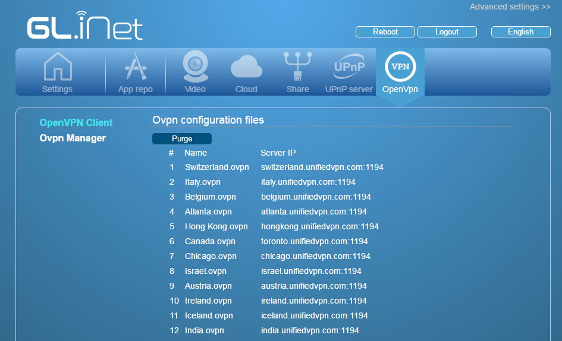


##Where to get ovpn Files

You probably have .ovpn files already. If not, you can buy from a trusted vpn service provider. We tested Astrill and FinchVPN. If you use other service providers and have problem of setting up the vpn, please let us know.


##Using Astrill

Astrill provides 7-day trial if you sign up.

After logging in your accout, go to "VPN Services" then click "OpenVPN certifictes".

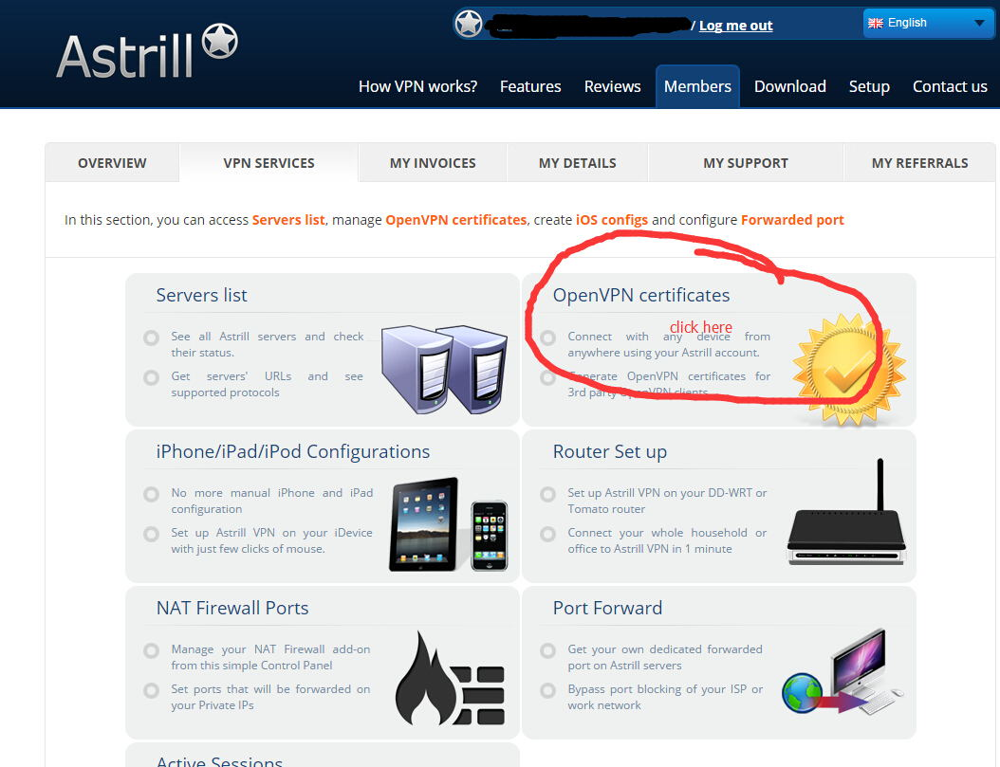

You need to type description and choose Type. Don't choose "split routing for China". It is only for China users and don't work well with our current firmware. Then click "Add to my certifcates". You will find the zip file on the list below. Click "Download" to get the zip file, which contains more than 100 files.

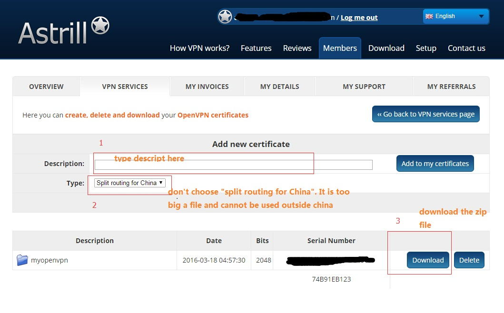


##Using FinchVPN

FinchVPN provide free account so you can have a try before you buy.

I tried the first link.


You can choose to download each file for free servers or download as a zip.

The API key here is your password.


##Using StrongVPN

For StrongVPN, first go to "VPN Accounts->VPN Accounts Summary", then you can download the ovpn config for the choosen server.

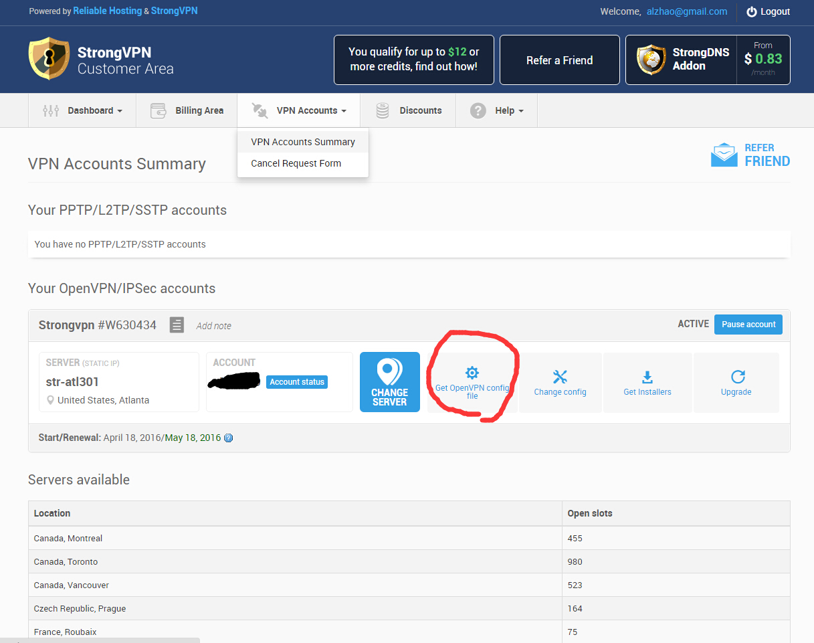

##Using Hidemyass VPN

Hide My Ass VPN's ovpn files can be downloaded from their server directly: https://www.hidemyass.com/vpn-config

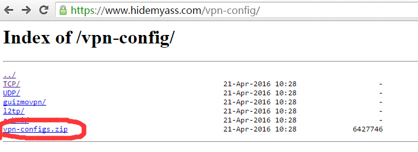

##Using ProXPN

ProXPN doesn't have ovpn files available for downloading directly. You can refer to [this link](http://downgoat.net/proxpn-openvpn-on-linux-configuration.html) for detailed info.

You need to download their mac source and unzip the file. Extract the content of config.

You need to move the content in ssl to the same file of ovpn.

So the file contains "client.key", "proxpn.ovpn", "car.crt" and "client.crt". Now open "proxpn.ovpn" and ucomment the following line
```
remote miami.proxpn.com 443
```
You can also change to other services, including:
```
uk.proxpn.com - United Kingdom
nl.proxpn.com - Netherlands
sg.proxpn.com - Singapore
seattle.proxpn.com - Seattle
miami.proxpn.com - Miami

```
Finally you can zip them into one file and upload to the router.


##Using ExpressVPN

Express VPN is easy 

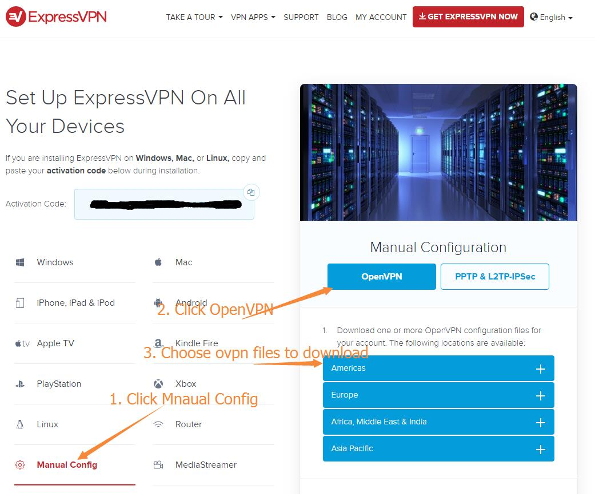

##Using TorGuard

If you are using TorGuard, you need to login the control panel and generate the ovpn file from the "Tools" menu. Please select "All", using udp or tcp and select Cipher. Then press `Generate Config` and the zip file will be downloaded automatically.

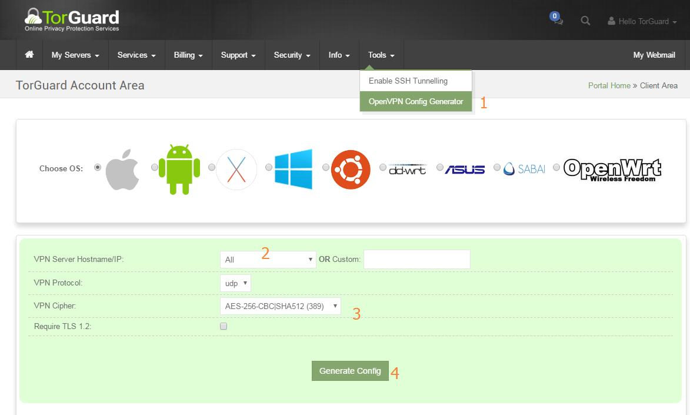

The username and password for openvpn connection is different from your control panel login. You can change the service username and password in Security manual. You can generate a random login username and password.

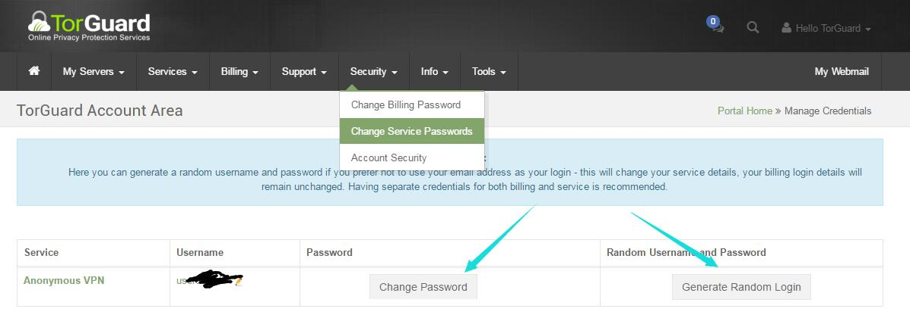

##VPN Compatibilities

We have checked a number of public vpn service providers and tested the compatibilities. What you need to do is purchase a subscription from them and download the ovpn files.

Here is a list of compatible services (v2.20).

__Note: For service issues, please contact the service provider directly.__

1. TorGuard, [https://torguard.net]<https://torguard.net/aff.php?aff=3040>
2. Astrill, https://www.astrill.com
3. FinchVPN, https://www.finchvpn.com/
4. Free Vpn Software, http://freevpnsoftware.net/
5. VPNBook, http://www.vpnbook.com/
6. VPNGate, http://www.vpngate.net/
7. VPN Area, https://vpnarea.com
8. NordVPN, https://nordvpn.com/
9. PIA, https://www.privateinternetaccess.com/
10. PureVPN, https://www.purevpn.com/
11. TotalVPN, https://www.totalvpn.com
12. Strong VPN, http://strongvpn.com/
13. HideMyAss, https://www.hidemyass.com
14. Proxy.sh, https://proxy.sh/
15. TCPVPN.com, https://www.tcpvpn.com
16. Vpn.AC, https://www.vpn.ac/
17. Proxpn, https://www.proxpn.com
18. ExpressVPN, https://www.expressvpn.com/
19. Airvpn, https://airvpn.org/
20. CactusVpn, https://www.cactusvpn.com/
21. Keepsolid,   <https://www.keepsolid.com>
22. IPVanish, https://www.ipvanish.com
23. SaferVPN, https://www.safervpn.com
24. IVACY, https://www.ivacy.com 

# Discussions
