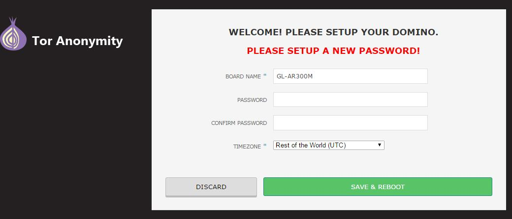
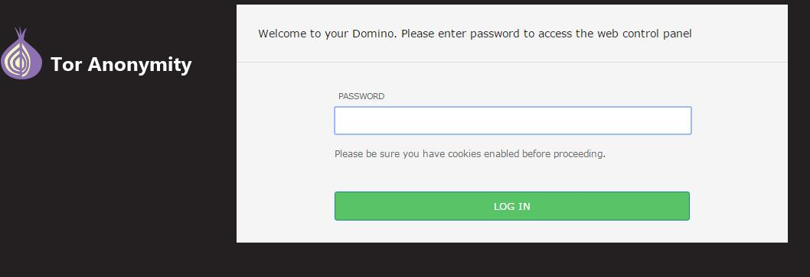
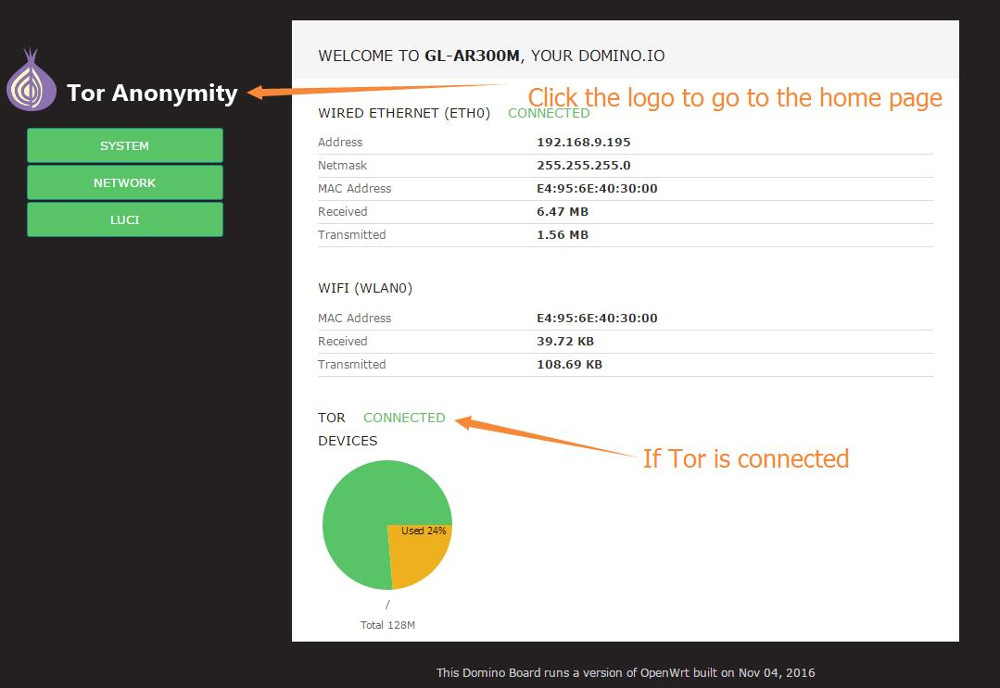
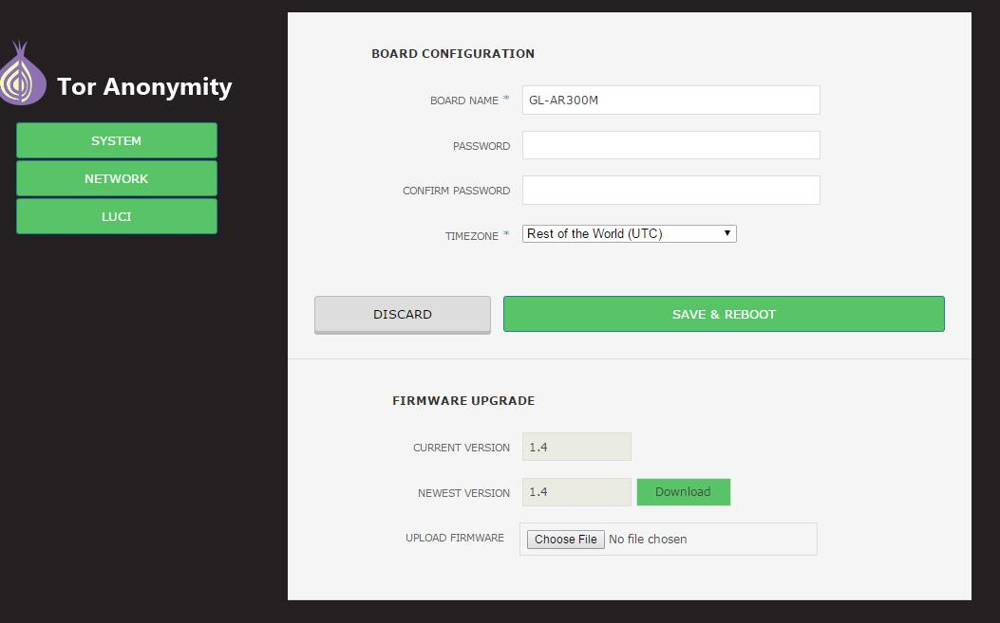
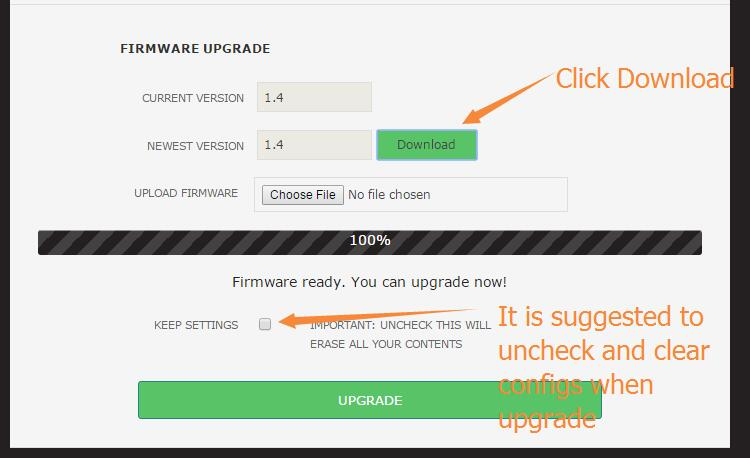
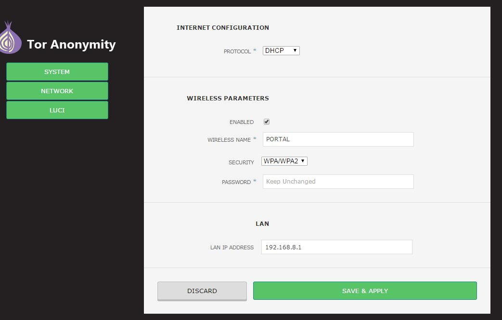
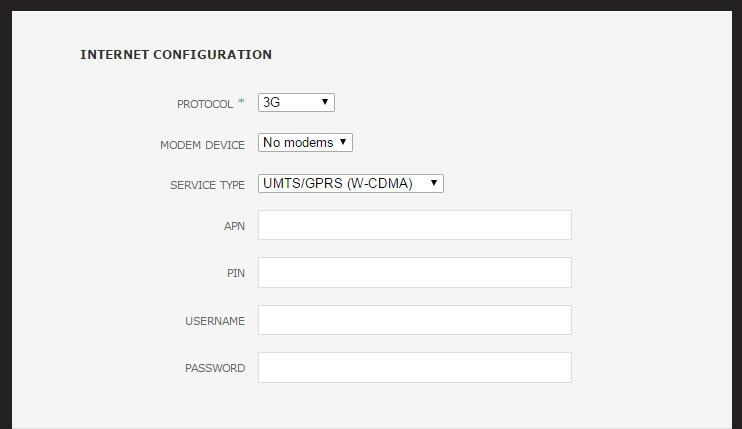
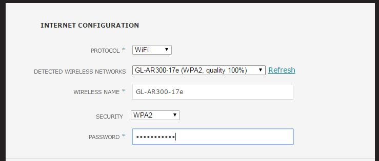
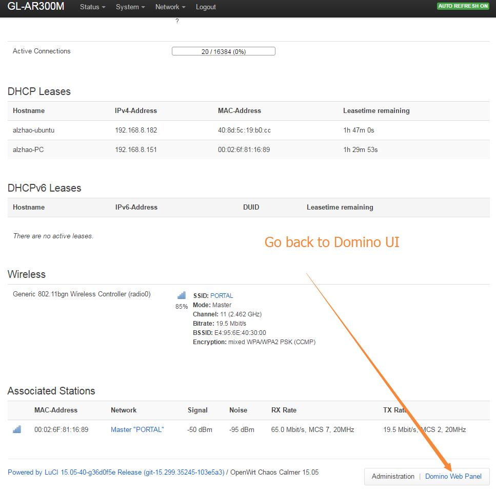

Using Tor in OpenWrt and GLi Routers
===================================

Tor firmware

Note: **This Tor firmware is totally free and no warranty.** Refer to the forum for help!

##Versions and supported devices

We have several version of Tor firmware and here is the summary. 

###Version 1.4:
Only support GL-AR150, GL-AR300M, GL-MT300N, GL-MT300A, which has a switch button controlling if you traffice should go through Tor.

Most of these instructions are for version 1.4.

###Version 1.3: 
Support GL-AR150, GL.iNet6416, GL-AR300. This firmware create two ssid: OpenWrt and Tor. If you conenct to OpenWrt you will have normal Internet. If you connect to Tor, you will be connect to Tor network. This firmware has a built-in UI based on Domino Pi which you can manage two SSIDs.

###Version 1.0 with Luci:
Support GL-MT300A and GL-MT300N. This is the firmware created for MT300A and MT300N with Luci. This firmware create two ssid: OpenWrt and Tor. If you conenct to OpenWrt you will have normal Internet. If you connect to Tor, you will be connect to Tor network. Connection from LAN port will always have Tor. Luci is installed but there is no Domino Pi UI.

Note: If you have questions about versions, please ask here or in the forum.

##Download and Flashing the firmware to the device

All the firmwares is available at http://www.gl-inet.com/firmware
Find your device name and then "tor" folder. Download the newest firmware.

You need to refer to https://www.gl-inet.com/docs/mini/firmware/ for instructions to flash the firmware to the router. 

##Using the firmware UI

After you flash the firmware to your device, when it reboots you need to set up the device at http://192.168.8.1. The default wifi password is `goodlife`.

NOTE: **You need to move the hardware switch to the right side if you want to access the UI**. Otherwise you are connecting to the Tor network and will not be able to access the UI. This is for security reasons.

###First time setup
The first time you acess the setting UI, you will be asked to setup a new password immediatelly. Just choose a password and your TimeZone and submit. The device will NOT reboot in firmware 1.4.

NOTE: **This doesn't change your WiFi password. Change it later.**

###Login

You will be asked to login using your NEW password now.

###Homepage

The UI is based on Domino Pi. It is quite simple. In your homepage you will be displayed with:
1. Your network status
2. Tor status. Please note if your tor reconnects this information may not be accurate. 
3. Usage of your flash

###System and firmware upgrade

You can click the `SYSTEM` button from the left sidebar to view the system information, including:
1. Your router's name
2. Change your password
3. Change your timezone
4. Check your firmware version and upgrade it, from online or mannually.

If the firmware on our website is neweer, you can click `Download` and follow the instructions to upgrade the firmware.

###Network Settings

Click the `NETWORK` button on the left sidebarr to view and change the network settings, including:
1. Internet protocol: `dhcp`, `static`, `pppoe`, `3g`, `tethering` or `repeater`. Tethering only works in Android phones.
2. Wireless parameters: `ssid`, `encryption` and `passsword`
3. LAN IP

3G 4G settings

Repeater settings. It will search for available ssid automatically. You need to choose ssid and type your password. 

NOTE: **This firmware don't have repeater manager as our stock firmware.** If you move to another location, your wifi maybe not work and you need to re-setup. Refer to the button action section in this page.

###Luci

Click the `LUCI` button on the left sidebar you can have the LUCI UI. You can go back to Domino UI by clicking the `Domino Web Panel` link on the bottom right corner.

##Reset button and hardware switch usage
Reset button and switch is assigned special functions.

###Reset
When you press down the reset button, the middle LED will start to flash, once per second. After 3 seconds, it will start quicker, twice per second. Now release your finger your network will revert to factory status. **Use this function if your repeater cannot connect which causes your wifi down**

When you keep holding the reset button for 8 seconds, the middle LED will start to flash even quicker, 4 times per seconds. Release your finger now, your firmware will revert to factory status and reboot.

###Switch

1. Left side: You will be connected to Tor network. You cannot access the admin UI.
2. Rigth side: Normal Internet. You will be able to access the admin UI.
