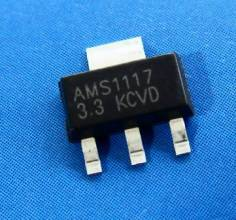

Domino Core

#Pinout diagram

Domino Core is based on a Atheros AP121 design and protected by a NDA with Qualcomm. So we cannot publish the design. However, we have made comprehensive pinout diagram of the Core board. 

[Domino Core Pinout Diagram](src/Domino-Core-Pinout.pdf)

#Domino Di base board

Domino Di is a bare PCB for playing with Domino Core. You can solder the Domino Core onto the Di board as illustrated in this picture.

The design of Domino Di in github: https://github.com/domino-team/domino-hardware. Please check out the schematic, layout and BOM. 

###The components required

To make it work, here is the components that you should solder onto the Di board:

The minimum requirements is to solder the `AMS1117` for power and zero ohm `R6`.

It is better to solder `C3` and `C7` to make it works better.

To make the PCB antenna work, solder 0ohm `R8` and `R10`. Otherwise, connect a uFL antenna.

To use LED and toggle buttons, solder the other required components. 