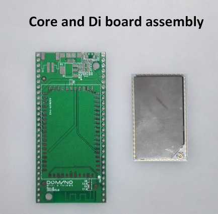
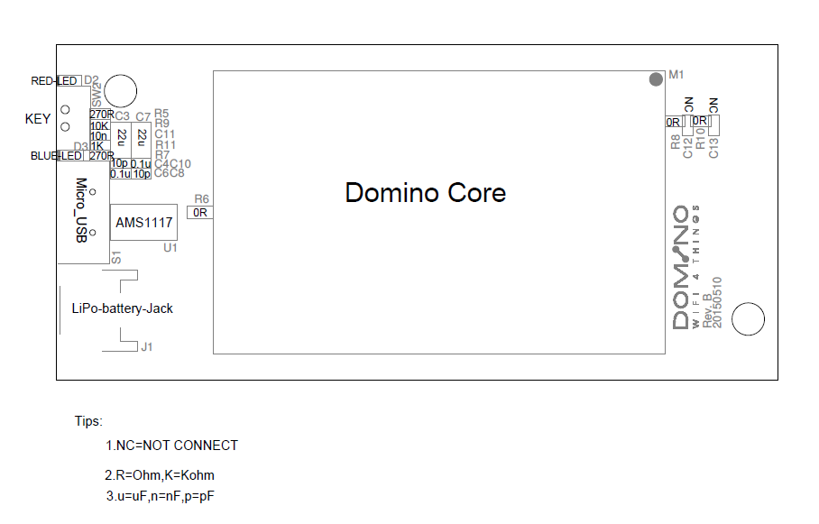

Domino Core

#Pinout diagram

Domino Core is based on a Atheros AP121 design and protected by a NDA with Qualcomm. So we cannot publish the design. However, we have made comprehensive pinout diagram of the Core board. 

[Domino Core Pinout Diagram](src/Domino-Core-Pinout.pdf)

#Domino Di base board

Domino Di is a bare PCB for playing with Domino Core. You can solder the Domino Core onto the Di board as illustrated in this picture.

The design of Domino Di in github: https://github.com/domino-team/domino-hardware. Please check out the schematic, layout and BOM. 

To make it work, here is the components that you should solder onto the Di board:

You should at least solder a AMS1117 power regulator and some resistors/capacitors. 

To make the PCB antenna work, solder 0ohm R8 and R10. Otherwise, connect a uFL antenna.