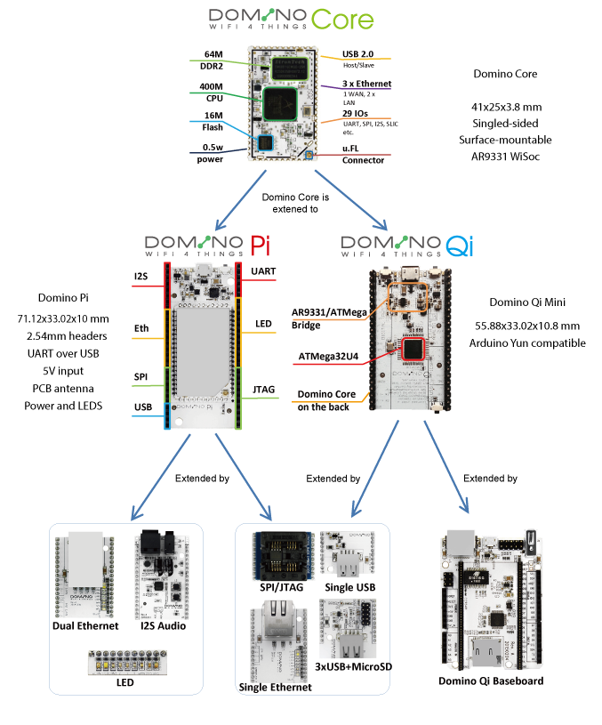
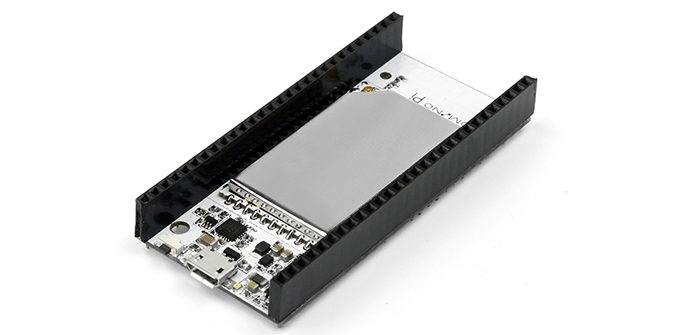

Gettting started

##gettting started with Domino

Thanks for using Domino. Domino is a high-performance 802.11 bgn WiFi hardware platform, with a modular design architecture, unlimited extension capabilities and Arduino compatibility. It is suitable for mass production, enhanced with full life-cycle services for makers.
The Domino Family has now 11 boards and more extensions will be developed. The tree structure of the boards is as below.

###Domino Core
Domino Core is the heart of Domino.IO. It is designed for makers to easily build their own products based on it. It is compact, only 1.6 square inches with 60 castellated pins (2mm pitch), 3xEthernet, USB2.0, serial port, SPI, I2S, SLIC, SPDIF, JTAG, 9xLEDs and 29 GPIOs. Check the the beautiful pinout diagram below for details.
Go to the [Domino Core hardware](hardware/core/) for more details of the hardware.

###Domino Pi
Domino Pi is designed both as a Domino Core development board and as an extension. You can develop your own board based on the Domino Pi. See the pinout diagram below. We have seven useful tile boards available, providing easy to use building blocks, enabling you to extend the Pi board as you wish.
Go to the [Domino Pi hardware](hardware/pi/) for more details of the hardware.
Go to the [Domino Pi section](pi/) for more details for how to use the Pi.

###Domino Qi
Domino Qi Mini is a small board that is a fully compatible derivative of the original Arduino Yùn, crammed into a tiny form factor. It is a low-cost, compact OpenWRT-based 802.11 bgn WiFi board based on Qualcomm/Atheros AR9331 WiSoC and on the Atmel ATMega32U4 MCU. Communication between the two chips is achieved using Arduino Yùn-compatible Bridge hardware and software library.
Plug the Domino Qi Mini board onto the Domino Qi baseboard to turn it into a board fully compatible with the ubiquitous Arduino Shield form factor and benefit from hundreds of already existing shields for rapid prototyping.
Go to the [Domino Qi hardware](hardware/qi/) for more details of the hardware.
Go to the [Domino Qi section](qi/) for more details for how to use the Qi.

##Where to get help

First you need to read this documents. We will try our best to make the documentation complete and detailed. 
Second, we will have our own forum open later, when you will be ask questions there.
Third, go the existing community of [OpenWrt](http://www.openwrt.org) if you want to explore the embedded Linux system, and go to [Arduino](http://arduino.cc) if you want to explore the features related to Arduino.
