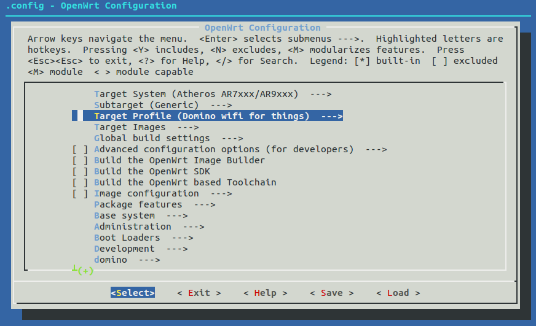
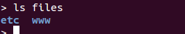
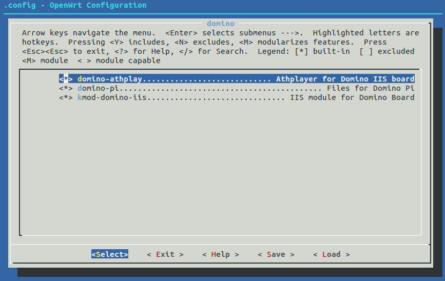

#Compile the firmware
It is not difficult for you to compile your own OpenWrt firmware for Domino. Follow these instructions step by step.

Knowing Openwrt
===============

OpenWrt is a Linux distribution for embedded devices. You can find all the details of OpenWrt from http://openwrt.org
To compile an OpenWrt fireware for Domino, first you need to have a Linux environment. We will use Ubuntu as as example in this guide.

###1. Build environment

First install all the necessary packages:
```
#sudo apt-get update 
#sudo apt-get install subversion build-essential git-core libncurses5-dev zlib1g-dev gawk flex quilt 
libssl-dev xsltproc libxml-parser-perl mercurial bzr ecj cvs unzip 
```

###2. Download OpenWrt
For domino-Pi, we use OpenWrt release BB1407.
```
git clone git://git.openwrt.org/14.07/openwrt.git openwrt-domino
cd openwrt-domino
./scripts/feeds update -a
./scripts/feeds install -a
```

###3. Install Quilt for patches
Refer to http://wiki.openwrt.org/doc/devel/patches to understand how OpenWrt deal with patches. We will need to apply a patch to OpenWrt.
```
sudo apt-get install quilt
cat > ~/.quiltrc <<EOF
QUILT_DIFF_ARGS="--no-timestamps --no-index -p ab --color=auto"
QUILT_REFRESH_ARGS="--no-timestamps --no-index -p ab"
QUILT_PATCH_OPTS="--unified"
QUILT_DIFF_OPTS="-p"
EDITOR="nano"
EOF
```

###4. Apply Domino Target Patch
Download the Domino Target Patch from here: https://github.com/domino-team/domino-firmware/tree/master/domino-pi/openwrt-patch 
Put them in openwrt-domino/patches.
```
mkdir patches
cp domino.patch series ./patches
quilt push -a
rm ./tmp/*
./scripts/feeds install -a
```
In order to make the Target appear, you may need to run `rm ./tmp/*` and `./scripts/feeds install -a`

###5. Make menuconfig
Now you need to configure OpenWrt by choosing the correct target.
```
make menuconfig
```



Select "Domino Wifi for things" in the "Target Profile". Exit and save the config file. Now you are ready to build the firmware.
```
make 
```
If you want to use multithread, run `make -j x`, x is a number.
```
make -j 5
```
You probably will encounter errors and compiling process will exit without showing you the details. You can run `make V=s` to show the details. Sometime it may be just a problem of downloading resources.
```
make V=s
```
After make finishes, you will find the firmware in bin folder. The correct one is: `openwrt-ar71xx-generic-domino-squashfs-sysupgrade.bin`
```
ls bin/ar71xx
```

Please be noticed that you will built a very basic firmware without web UI and wifi is disabled. You will be flustrated that it doesn't work as expected. Now read on to compile more packages.

Domino Pi Packages
===================

###Download Domino sources
If you want to build exactly the same firmware as pre-installed in Domino Pi, read on.

Download domino package from github: https://github.com/domino-team/domino-firmware/tree/master/domino-pi, including athplay, domino-pi, iis, mpg123
Put these packages in openwrt-domino/package/domino


Put the files in root-files to "files" folder of openwrt. This is a quick and easy to compile your default config to openwrt.



###Make menuconfig

Type `make menuconfig` and select domino specific packages.



You will find "domino-athplay", "domino-pi" and "kmod-domino-iis" in "Domino" category. Select them all by pressing space key until it shows a * before the package. If you don't want audio, remove "domino-athplay" and "kmod-domino-iis" from the selction. Also select "Utilities->mpg123" if you want to play music. 

That is all. You don't need to select any other packages because they are already selected automaticly.

###compile
Now compile the firmware by typing `make`
```
make
```


