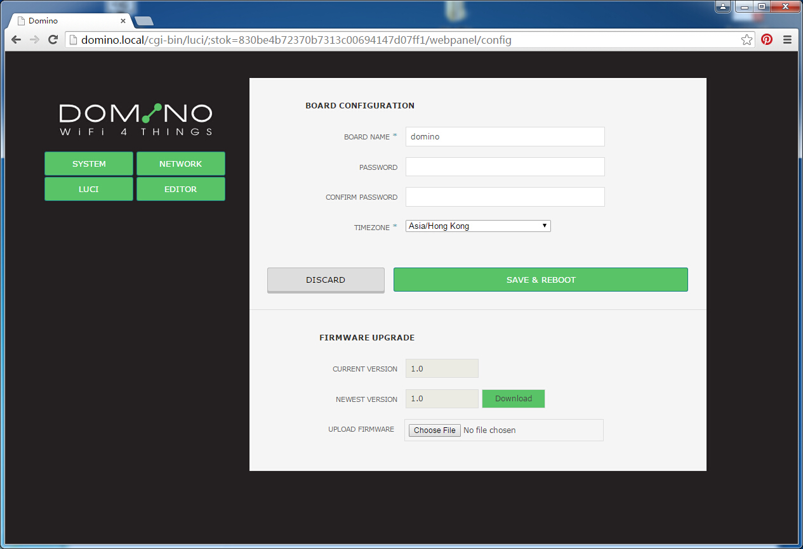
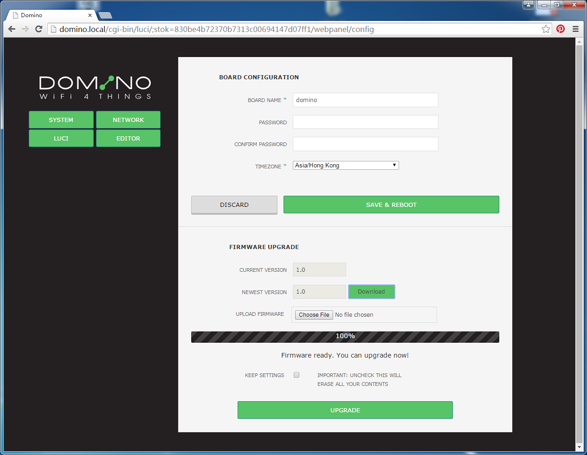
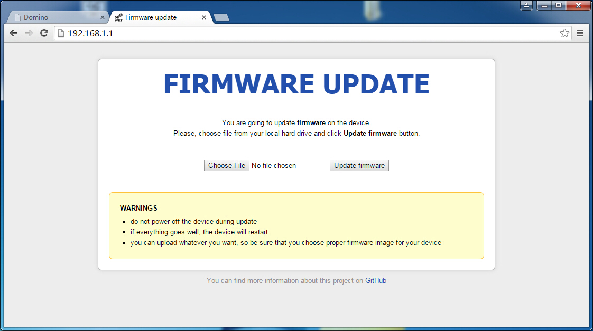

#Flashing and debricking

Domino Pi is designed for you to play with OpenWrt and embedded system. Before you continue to change your firmware, read [Working with serial](serial.html) section first.


##Firmware compabilities

Domino is compatible with some common OpenWrt firmware for Atheros 9331 SoC, including the firmware for GL-AR150, Carambola2 and Dragino. Due to size and configuration of bootloader, Domino cannot boot firmware for TP-Link 703n, 720n without change the bootloader.


##Flashing firmware using the WebUI

We encourage you to flash your firmware using the WebUI provided. When viewing in "System" page, you will see the UI for you to upgrade/flash your firmware. 


If you want to upload your firmware in your disk, just click "Choose File" and upload the firmware. After upload you will be prompted with option to "keep settings" or not. Then click "UPGRADE" to upgrade your firmware. You can also upgrade your firmware by click the "Download" button next to "Newest version". 



**ATTENTION**: In firmware version 1.0 and 1.1, there is a bug for Chrome. Please use Firefox or IE for upgrading your firmware.


##Flashing using uboot WebUI

In case you accediently brick your Domino firmware, you can debrick using uboot. You don't have to use serial if you want to use the uboot WebUI.

###Step 1: Connection

Connect an Ethernet cable from your computer to Domino directly. Set your computer's IP address to `192.168.1.2` manually. If you are using a Dual-Ethernet tile board, **only connect one Ethernet cable to your Domino kit**. 


###Step 2: Activate the uboot WebUI

Press and hole the reset button while powering on your Domino. You will see the <font color=blue>Blue LED</font> for Wireless flashing. After it flashes for 5 times, the WAN led will light up. Now release your finger. The WAN LED will flash quite quickly for some times.

###Step 3: Flash firmware

Now use a web broser and go to http://192.168.1.1, you will then have the uboot WebUI as below.



Now choose your firmware and click "Update firmware". Wait about 3 minutes so that your board reset and boot.

**ATTENTION**: DON'T turn off power uding this process.

**ATTENTION**: Uboot wont check the validity of the firmware. Even if you flashed a wrong firmware, it will still write it to flash.


##Flashing using uboot console

If your firmware still cannot boot up, try this advanced option. To use uboot console, please refer to [Working with serial](serial.html) first. 

**ATTENTION**: It is better to use a separate USB-UART adapter to use the uboot console. uboot boot very quickly so you might not have time to enter the uboot console if you are using integrated USB-UART bridge. System especially windows is slow in loading the correct driver for you.

###Enter the uboot console

In your serial term, press `anykey` when uboot boot and stop it in its console. Some version of uboot will ask your to type `gl` to enter the console.


###Uboot environment variables

Type `printenv` to display the environment variables. Don't modify these variables if you are not sure what you are doing.


###Set up a tftp server

You need to set up a tftp server. In windows, we recommend tftpd32 or tftpd64 according to your system architecture. Download them from [junin.net](http://www.jounin.net/tftpd32_download.html).

In Linux, we recommend tftpd-hpa, search for a guidance in google. 

###Update using the stored procedure

You can update your firmware or uboot very simply using the procedure stored as environment variables.

To update the firmware, name your firmware file as `openwrt-domino.bin` and put it in your tftp server. Then run `run lf`. Just wait until this process finish.

To update the uboot, name your uboot as `uboot_for_domino.bin` and run `run lu` to change the uboot itself.

**ATTENTION**: Changing uboot can be very dangerous. Do this at your own risk.

###Update using uboot command

You can also update the firmware and everything else using the uboot command.

To update the firmware, use the following command. Replace with your own filename for your firmware.

```
tftp 0x81000000 openwrt-domino.bin
erase 0x9f050000 +$filesize
cp.b 0x81000000 0x9f050000 $filesize
```

To update the uboot, use the following command. Replace the filename as your real name.

```
tftp 0x81000000 uboot_for_domino.bin
erase 0x9f000000 0x40000
cp.b 0x81000000 0x9f000000 0x40000
```

**ATTENTION**: Changing uboot can be very dangerous. Do this at your own risk.

#Debrick using SPI tile board

If you accidently have problem with uboot and it cannot boot up totally, the only way is to using the SPI/JTAG tile board. Refer to the following link for info.
https://www.kickstarter.com/projects/706167548/dominoio-an-open-hardware-wifi-platform-for-things/posts/1200391
