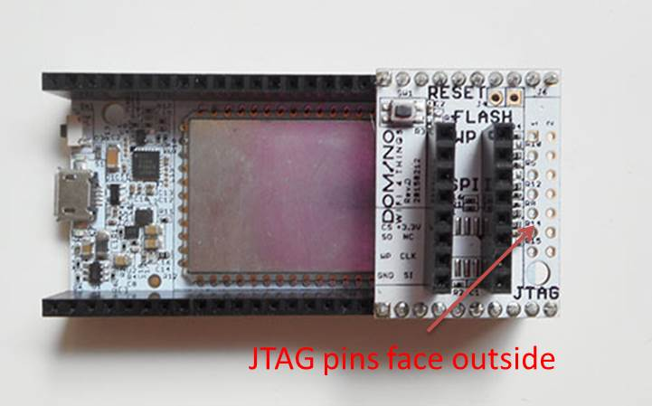

SPI/JTAG tile

#Mounting

When using the SPI/JTAG tile board, it is important to mount the tile board in the correct direction. The jtag pins should face outside, as the picture illustated.

When plugin the flash adapter, do as this picture illustrated. The falsh should be mounted on the bottom part of the adapter. There is one dot on the flash, be sure to let it in the correct corner.

**ATTENTION:** If you mount the flash reversed, it will burn in seconds when powered on.

#Debrick using SPI tile board

If you accidently have problem with uboot and it cannot boot up totally, the only way is to using the SPI/JTAG tile board. Refer to the following link for info.
https://www.kickstarter.com/projects/706167548/dominoio-an-open-hardware-wifi-platform-for-things/posts/1200391

