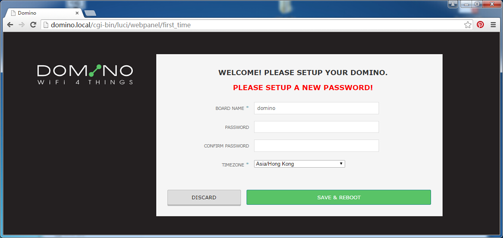
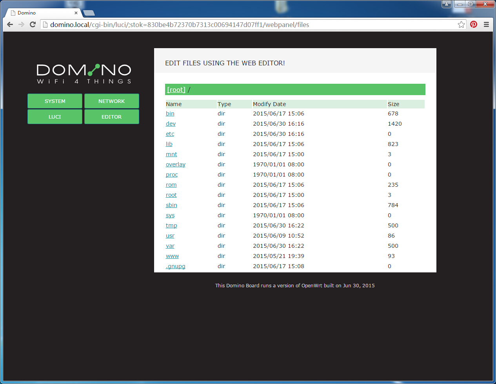

Using Domino Pi

#LED and buttons

#First time use

The first time you use your Domino, it will ask you to setup the name and a password. Then reboot your device.

**ATTENTION**: The password is only for the embedded Linux system, not your wifi. If you want to change your wifi password, logon the system and change it later.

**ATTENTION**: If you change your boards name, for example to "myboard", after reboot, you will need to use http://myboard.local to find it.

#Connect to the Internet

#Change Wifi and LAN settings

#Working with USB devices

#Code editor

#LUCI

